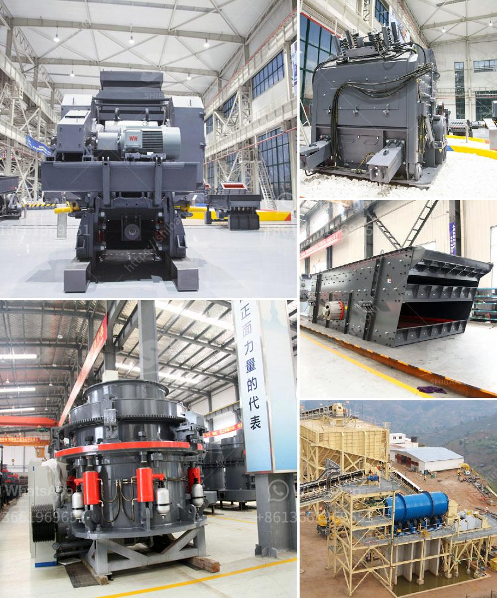

<h3>toner production line suppliers</h3>
The printing industry has greatly evolved over the years with the development of advanced technologies and the growing demand for efficient and high-quality printing solutions. Toner production line suppliers play a crucial role in meeting these demands by providing printing companies with top-notch toner production equipment.

Toner is a fine powder that is used in laser printers and photocopiers to produce high-quality and long-lasting prints. Toner production involves a series of complex processes that require specialized machinery and expertise. This is where toner production line suppliers come in. They are responsible for designing, manufacturing, and supplying the production line equipment necessary to produce toner cartridges.

One of the key factors that distinguish a reliable toner production line supplier is their ability to deliver efficient and cost-effective solutions. In an industry where speed and quality are of utmost importance, suppliers need to provide equipment that can meet the high production demands of printing companies while maintaining impeccable print quality standards.

These suppliers typically offer a range of equipment for the different stages of toner production, including raw material mixing, grinding, classifying, drying, and packaging. Each stage requires specialized machinery that is designed to ensure the precise composition and quality of the toner powder. Suppliers often work closely with their clients to understand their specific requirements and provide tailored solutions that meet their individual production needs.

Quality control is another crucial aspect of toner production, and reliable suppliers are equipped with testing and inspection facilities to ensure the quality of the toner powder. This involves rigorous testing of factors such as particle size distribution, chemical composition, and print quality. Suppliers that prioritize quality control are more likely to have satisfied customers who can rely on consistent print performance.

In addition to equipment, toner production line suppliers often provide technical support and maintenance services to their clients. This is essential for printing companies as they need to keep their production lines running smoothly to meet their customers' demands. Suppliers that offer prompt technical support and maintenance services ensure minimal downtime and maximum productivity for their clients.

Furthermore, sustainable and eco-friendly practices are becoming increasingly important in the printing industry. Responsible toner production line suppliers are committed to reducing the environmental impact of their equipment and processes. They employ energy-saving technologies and promote the use of recyclable materials in their production lines. Printing companies that prioritize sustainability can partner with suppliers that share the same values.

In conclusion, toner production line suppliers play a vital role in the printing industry by providing the necessary equipment for the production of high-quality toner cartridges. Reliable suppliers deliver efficient and cost-effective solutions that meet the high demands of printing companies. They prioritize quality control, offer technical support and maintenance services, and promote sustainable practices. The partnership between printing companies and toner production line suppliers is integral to the development and success of the printing industry as a whole.
<h3>Contact us</h3><ul><li><strong>Whatsapp:&nbsp;<a href="https://wa.me/8613661969651">+8613661969651</a></strong></li><li><a href="https://swt.shibang-china.com/?git&amp;zhl&amp;toner production line suppliers"><strong>Online Service(chat now)</strong></a></li></ul><h3>Related</h3><ul><li><a href='cost of hammer mill.md'>cost of hammer mill</a></li><li><a href='crusher seller in ethiopia.md'>crusher seller in ethiopia</a></li><li><a href='jaw roll crusher.md'>jaw roll crusher</a></li><li><a href='thailand charcoal briquette machine for sale.md'>thailand charcoal briquette machine for sale</a></li><li><a href='stone crusher plant price.md'>stone crusher plant price</a></li></ul>