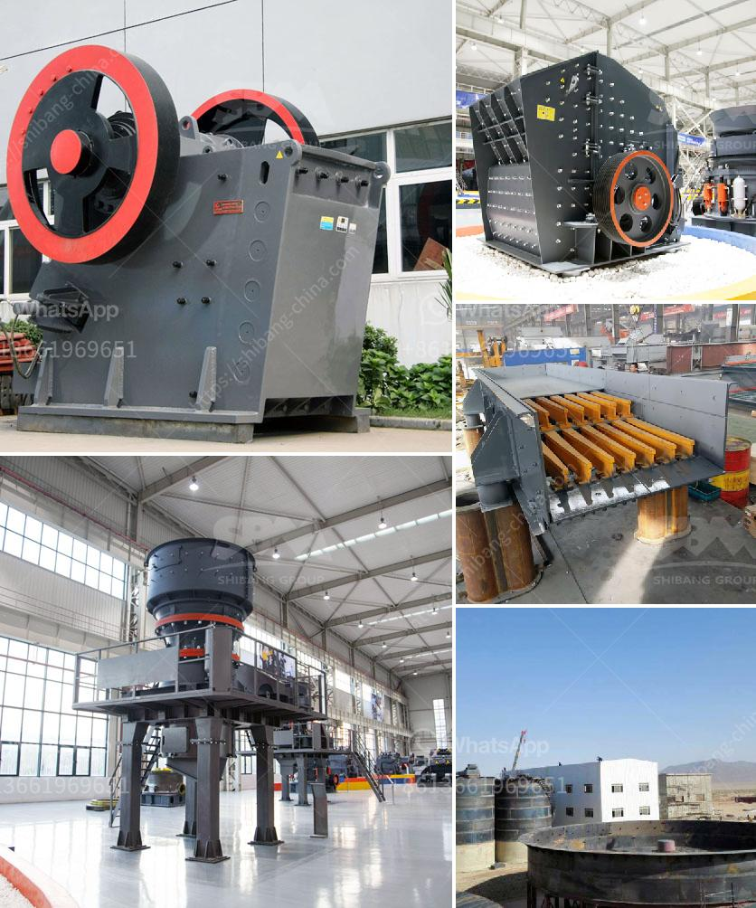

<h3>tons a hour wash plant</h3>
In the mining industry, where production targets and cost efficiency are of utmost importance, the tons per hour (TPH) wash plant has emerged as a game-changer. With its ability to process large volumes of material within a short span of time, this cutting-edge equipment is revolutionizing mining operations around the globe.

The TPH wash plant is uniquely designed to effectively process significant quantities of material, ensuring optimal throughput per hour. Equipped with state-of-the-art technology, this high-capacity wash plant enables miners to achieve top-notch efficiency without compromising quality. By streamlining the separation and washing process, significant savings in time and resources can be realized.

The TPH wash plant's versatility is another key factor contributing to its widespread adoption. This adaptable equipment is capable of handling various types of materials, ranging from aggregates to minerals. Additionally, it can be customized to suit specific mining requirements, ensuring efficient and precise processing for different applications.

One of the primary advantages of the TPH wash plant is its ability to enhance recovery rates. High volumes of material can be processed and refined in a single hour, maximizing the extraction of valuable minerals or metals. This not only increases the profitability of mining operations but also reduces environmental impact by minimizing waste.

Efficiency is a crucial factor in determining operational costs in the mining industry. The TPH wash plant's ability to process large quantities of material translates into significant cost savings. By reducing the need for multiple processing cycles and equipment, the wash plant eliminates associated expenses, such as fuel consumption, maintenance, and labor. This leads to improved overall financial performance.

As sustainability becomes a priority for mining companies, the TPH wash plant offers a viable solution for minimizing the environmental footprint. Its high processing capacity ensures fewer extraction sites, reducing land disturbance concerns. Moreover, the wash plant's advanced water management systems and utilization of recycled water help conserve this precious resource, addressing sustainability goals.

The TPH wash plant's ability to handle high volumes of material expeditiously also optimizes workforce utilization. With its efficient and speedy processing, mining personnel can focus on other crucial tasks, such as exploration, monitoring, and safety. By reducing manual labor requirements, the wash plant contributes to a safer working environment, reducing the risk of accidents and injuries.

The tons per hour wash plant has undoubtedly revolutionized mining operations. With its ability to process vast amounts of material efficiently, this equipment maximizes productivity, optimizes cost, enhances recovery rates, and reduces the environmental impact. Its versatility and adaptability make it an appealing choice for mining operations worldwide, ensuring a brighter, more efficient future for the industry as a whole.
<h3>Contact us</h3><ul><li><strong>Whatsapp:&nbsp;<a href="https://wa.me/8613661969651">+8613661969651</a></strong></li><li><a href="https://swt.shibang-china.com/?git&amp;zhl&amp;tons a hour wash plant"><strong>Online Service(chat now)</strong></a></li></ul><h3>Related</h3><ul><li><a href='marble jaw crusher.md'>marble jaw crusher</a></li><li><a href='dry grinding mill.md'>dry grinding mill</a></li><li><a href='crusher manufacturer in china.md'>crusher manufacturer in china</a></li><li><a href='vibrating screens price in south africa.md'>vibrating screens price in south africa</a></li><li><a href='rumus tegangan pada belt conveyor.md'>rumus tegangan pada belt conveyor</a></li></ul>