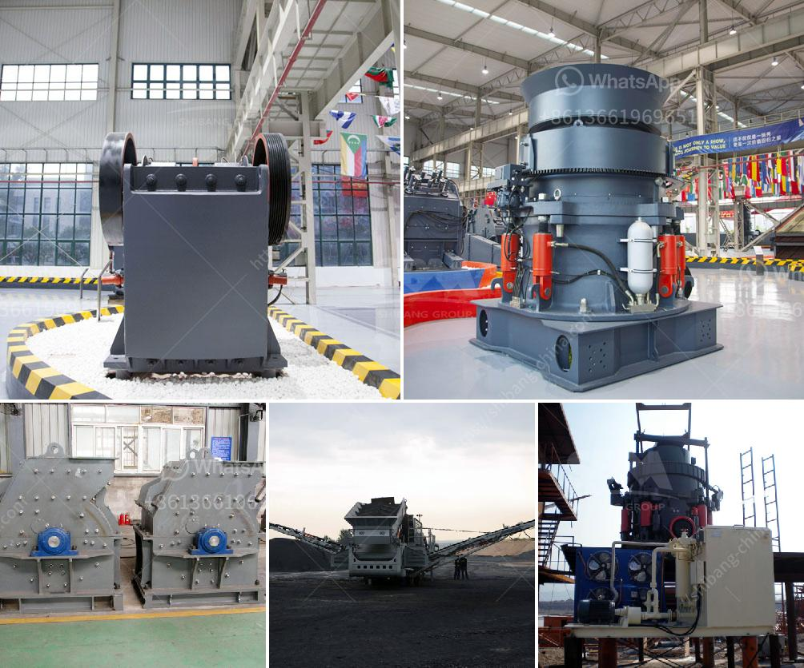

<h3>track-mounted equipment</h3>
Track-mounted equipment has revolutionized many industries by offering increased mobility, maneuverability, and productivity. Whether it be excavators, crushers, or screening plants, these machines provide a versatile and efficient solution for heavy-duty applications.

One of the primary advantages of track-mounted equipment is its ability to navigate challenging terrains with ease. Unlike traditional wheeled equipment, these machines are equipped with heavy-duty tracks that distribute weight evenly, providing stability and traction on uneven surfaces, slopes, and even soft grounds. This makes them the perfect choice for construction sites, mining operations, and other rugged environments.

Another significant benefit is their exceptional maneuverability. With their compact size and enhanced agility, track-mounted equipment can access narrow spaces and operate efficiently in confined areas. This versatility saves time and money by eliminating the need for additional manual labor and reducing the risk of damage to surrounding structures.

Furthermore, track-mounted equipment offers higher productivity due to its increased mobility. These machines can swiftly move from one job site to another without the need for extensive dismantling or transportation. This advantage significantly reduces downtime and allows for quick setup and operation, ultimately improving overall efficiency.

In addition to their inherent features, track-mounted equipment can be equipped with a variety of attachments, enhancing their versatility. Whether it's a hydraulic breaker, grapple, or bucket, these machines can be customized to meet specific job requirements. This adaptability makes them indispensable in industries such as demolition, excavation, and material handling.

Overall, track-mounted equipment has transformed the way industries operate, providing a more efficient and effective solution for heavy-duty applications. Its ability to navigate challenging terrains, exceptional maneuverability, and enhanced productivity make it a preferred choice for many construction, mining, and material handling projects. As technology continues to advance, we can expect further advancements in track-mounted equipment, contributing to safer, faster, and more productive operations.
<h3>Contact us</h3><ul><li><strong>Whatsapp:&nbsp;<a href="https://wa.me/8613661969651">+8613661969651</a></strong></li><li><a href="https://swt.shibang-china.com/?git&amp;zhl&amp;trackmounted equipment"><strong>Online Service(chat now)</strong></a></li></ul><h3>Related</h3><ul><li><a href='belt conveyor 12mm.md'>belt conveyor 12mm</a></li><li><a href='bentonite pulverizer crusher manufacturer.md'>bentonite pulverizer crusher manufacturer</a></li><li><a href='manganese metal production process.md'>manganese metal production process</a></li><li><a href='gypsum board manufacturing process.md'>gypsum board manufacturing process</a></li><li><a href='granite quarrying and processing firm in kaduna.md'>granite quarrying and processing firm in kaduna</a></li></ul>