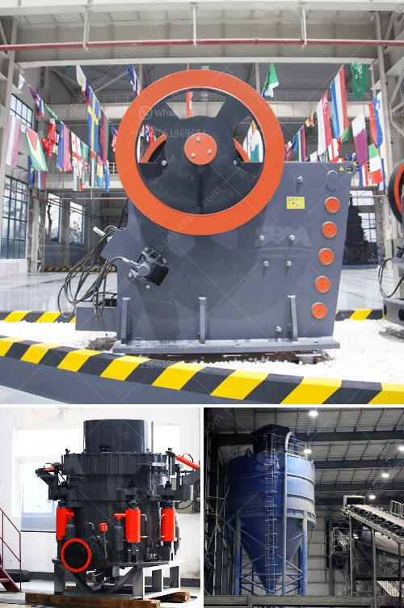

<h3>tractor pto stone crusher for sale</h3>
Are you in the market for a tractor PTO stone crusher? Are you struggling to find one that suits your needs? If so, look no further as we have the perfect solution for you. The Valentini Leon Series PTO stone crusher is the ideal machine for those looking to achieve an efficient and uniform crush on rough terrain or over large areas, while avoiding damage to the environment.

The Valentini Leon Series stone crushers are designed with an optimized transmission system to help deliver high crushing power to the stones while maintaining reliability. With their range of working depths, these machines can grind stones down to a maximum soil depth of 20 cm (8 inches). The stone crusher is also suitable for road construction projects, where the soil is compacted and need to be converted into gravel for the construction site.

One notable feature about the Valentini Leon Series stone crusher is the ability to change the rotor speed without compromising the crushing action. This means that the machine can be adjusted to suit different types of stone, regardless of their hardness or size. The variable rotor speed also allows the user to adjust the machine's performance depending on their specific needs. Whether you are looking to crush stones as fine as gravel or as coarse as large rocks, the Valentini Leon Series stone crusher can handle it.

Another advantage of the Valentini Leon Series stone crusher is its compatibility with both 540 and 1000 RPM PTO speed. This enables the machine to be installed on tractors with a power output of between 80 and 150 horsepower, making it versatile and suitable for a wide range of applications. The stone crusher is also equipped with a hydraulic system that allows for easy and quick clearance of any blockage, reducing downtime and ensuring optimal productivity.

When it comes to maintenance, the Valentini Leon Series stone crusher is designed with ease of use in mind. The machine's heavy-duty construction ensures durability and longevity, while the sealed bearings protect the internal components from dust and debris. Regular greasing of the bearings and periodic inspection of the hammers are all that is required to keep the stone crusher in optimal working condition.

In summary, if you are looking to invest in a tractor PTO stone crusher that offers efficiency, reliability, and versatility, then look no further than the Valentini Leon Series. With its variable rotor speed, compatibility with different tractor sizes, and easy maintenance requirements, this stone crusher is a reliable choice for those in need of crushing stones for various purposes. Don't wait any longer, contact your local dealer today and inquire about the Valentini Leon Series PTO stone crusher.
<h3>Contact us</h3><ul><li><strong>Whatsapp:&nbsp;<a href="https://wa.me/8613661969651">+8613661969651</a></strong></li><li><a href="https://swt.shibang-china.com/?git&amp;zhl&amp;tractor pto stone crusher for sale"><strong>Online Service(chat now)</strong></a></li></ul><h3>Related</h3><ul><li><a href='for sale stone crusher in sri lanka.md'>for sale stone crusher in sri lanka</a></li><li><a href='enquiry stone crusher.md'>enquiry stone crusher</a></li><li><a href='quote for china crusher.md'>quote for china crusher</a></li><li><a href='gypsum production line price.md'>gypsum production line price</a></li><li><a href='stone crusher machine 120 tonne per hour.md'>stone crusher machine 120 tonne per hour</a></li></ul>