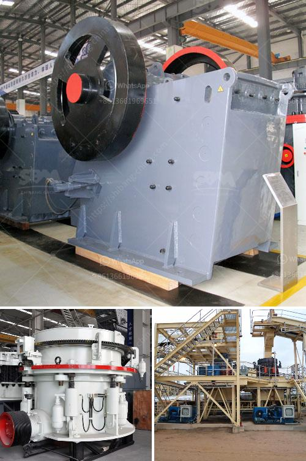

<h3>transmission for ball mill</h3>
Transmission mode of ball mill is divided into open gear and gear reducer, widely used in various industries, such as ball mill motor can be used to grind ore and other materials in the construction and metallurgical industries, and we can use it in chemical, coal, cement and other industries as well. With the continuous improvement of technology, the transmission mode of ball mill has also become more advanced and efficient.

Firstly, open gear transmission is the traditional transmission mode of ball mill. It has many advantages, such as simple structure, convenient installation and adjustment. The power consumption of open gear transmission is relatively low, which can effectively reduce the power loss caused by friction. However, the open gear transmission also has some disadvantages. For example, due to the open structure, dust and impurities are easily entered, which may affect the normal operation of the equipment. In addition, the maintenance and repair of open gear transmission are relatively complicated and time-consuming. Therefore, with the continuous improvement of technology, more and more enterprises are gradually switching to gear reducer transmission.

Gear reducer transmission is a new type of transmission mode, which can effectively reduce the noise and vibration of the equipment during operation. Compared with open gear transmission, gear reducer transmission has the advantages of small size, light weight, high transmission efficiency and reliable operation. At the same time, it can effectively protect the motor and reduce the failure rate of the motor. In addition, the maintenance and repair of gear reducer transmission are relatively simple and easy to operate. Therefore, gear reducer transmission has become the mainstream transmission mode of ball mill in recent years.

In addition, the transmission of ball mill is closely related to the selection of motor. At present, the main types of motors used in ball mills are asynchronous motor, synchronous motor and DC motor. Among them, asynchronous motor is the most widely used, mainly because of its low price and simple structure. Synchronous motor has the advantages of high power factor and efficiency, which can reduce the loss caused by harmonic current and improve the power quality. DC motor has the advantages of adjustable speed and good speed regulation performance, which can meet the requirements of various production processes.

In conclusion, the transmission mode of ball mill is an important factor affecting the performance and efficiency of the equipment. With the continuous improvement of technology, the transmission mode of ball mill is continuously optimized and upgraded. Whether it is open gear transmission or gear reducer transmission, it has its own advantages and disadvantages, and is suitable for different industries and production processes. Therefore, enterprises should choose the appropriate transmission mode according to their actual needs and conditions to achieve better production efficiency and economic benefits.
<h3>Contact us</h3><ul><li><strong>Whatsapp:&nbsp;<a href="https://wa.me/8613661969651">+8613661969651</a></strong></li><li><a href="https://swt.shibang-china.com/?git&amp;zhl&amp;transmission for ball mill"><strong>Online Service(chat now)</strong></a></li></ul><h3>Related</h3><ul><li><a href='mobile crushing and screening zimbabwe.md'>mobile crushing and screening zimbabwe</a></li><li><a href='hard rock quarry crusher in libya.md'>hard rock quarry crusher in libya</a></li><li><a href='raymond mill supplier.md'>raymond mill supplier</a></li><li><a href='ball mill to crusher carbon charcoal.md'>ball mill to crusher carbon charcoal</a></li><li><a href='marble crusher for sale.md'>marble crusher for sale</a></li></ul>