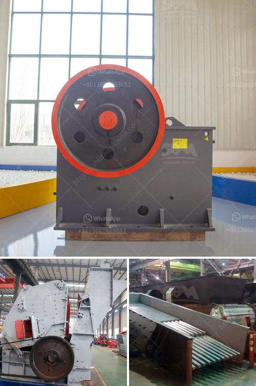

<h3>turkey stone crusher machine price</h3>
Turkey is one of the world’s largest producers of various types of stones such as granite, limestone, marble, and others. As a result, there is a great demand for stone crushers in Turkey. With the booming construction industry and infrastructure projects in the country, the need for stone crushing machines is increasing rapidly.

Stone crusher machines are used for crushing stones in various applications such as building materials, highways, railways, mines, and quarries. In recent years, Turkey has witnessed a significant growth in the construction industry with many ongoing projects and large-scale infrastructure investments. This has led to a surge in demand for stone crushers, contributing to the overall growth of the industry.

One of the key factors driving the demand for stone crusher machines in Turkey is the increasing government investment in infrastructure projects. The government has been investing heavily in the development of roads, bridges, airports, and other infrastructure facilities. This has created a huge demand for crushed stones, which are used as raw materials in the construction industry. As a result, the stone crusher machine market in Turkey is witnessing a significant growth.

The price of stone crusher machines in Turkey is a major concern for buyers. The stone crushing machines are distributed in various cities throughout the country. The suppliers of stone crusher machines are a lot as well. Among these suppliers, the price of stone crusher machines and the quality of them are different. The main suppliers of stone crusher machines are SBM, Sandvik, Puzzolana, FLS Smith, Metso and Joy Global.

In this article, we mainly introduce the requirements and price of stone crusher machines in Turkey. Requirements for the Stone Crusher Machines. In Turkey, the overall requirements are as follows: the maximum feeding size should not exceed 500mm; the output size should be between 50-350mm. According to the requirements of the Turkish stone crusher machine manufacturers, we know that the hardness of stones in Turkey is high and the humidity is low. Therefore, it is necessary to install a dehumidification device in the crushing chamber to control the humidity level and improve the performance of the crusher machine.

Price of Stone Crusher Machines. The price of the stone crusher machines in Turkey depends on the production capacity, quality, and size of the machine. The average price of a stone crusher machine is about $200,000 in Turkey. The price range varies from $150,000 to $600,000 depending on the capacity and features of the machine.

In summary, the price of stone crusher machine in Turkey is influenced by various factors, such as government investment in infrastructure projects, the overall demand for stone crushers in the country, and the competitiveness of the market. As the leading stone crusher machine manufacturer in Turkey, SBM will provide excellent machines with reasonable price for the customers all over the world.

In conclusion, Turkey has a flourishing stone crusher machine market and offers a wide range of prices to buyers. The stone crusher machines are highly advanced and are capable of crushing stones into fine particles. Buyer can select the best machine based on the required capacity and rock characteristics. If you are looking for a stone crusher machine in Turkey, SBM can be your reliable partner.
<h3>Contact us</h3><ul><li><strong>Whatsapp:&nbsp;<a href="https://wa.me/8613661969651">+8613661969651</a></strong></li><li><a href="https://swt.shibang-china.com/?git&amp;zhl&amp;turkey stone crusher machine price"><strong>Online Service(chat now)</strong></a></li></ul><h3>Related</h3><ul><li><a href='price of crusher of stone in peru.md'>price of crusher of stone in peru</a></li><li><a href='crusher power consumption.md'>crusher power consumption</a></li><li><a href='vsi crusher manufacturer.md'>vsi crusher manufacturer</a></li><li><a href='how to make marble powder statues.md'>how to make marble powder statues</a></li><li><a href='design design your alluvial mining plant.md'>design design your alluvial mining plant</a></li></ul>