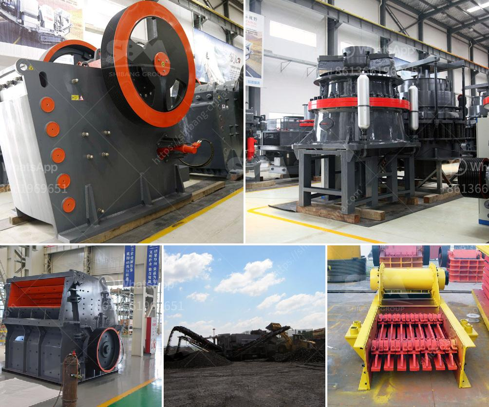

<h3>type of ball mill</h3>
The ball mill is a key equipment for grinding materials, widely used in powder-making production line such as cement, silicate sand, new-type building material, refractory material, fertilizer, ore dressing of ferrous metal and non-ferrous metal, glass ceramics, etc. Ball mill can grind various ores and materials with dry type or wet type. There are two kinds of ball mills, grate type and overfall type due to different ways of discharging material.

The grate type ball mill discharges material through the grate plate with the outlet, which retains the grinding media in the mill while allowing the ground material to pass through. The overfall type ball mill discharges material through the hollow shaft neck by the ore pulp so that the finished product is discharged by the flow. The overfall ball mill has low pulp surface and discharging fineness, and it is suitable for fine grinding.

1. Overflow type: As the name implies, the overflow type ball mill means that the discharge material from the hollow journal overflow discharge. Generally, the overflow type ball mill is suitable for grinding materials with a finer particle size, and the grid type ball mill is suitable for grinding materials with a coarse particle size.

2. Grate ball mill: this type is characterized by discharge grid plate, which has the convenience of discharging ore. The operation of the grate ball mill is more complicated than that of the overflow type ball mill, and the product fineness is generally less than 0.2mm, which is suitable for fine grinding operations.

3. Wet ball mill: Wet grinding is mainly used in mineral processing, ceramics and chemical industries. It can mill and pulverize various materials into fine powder. Wet ball mill is widely used in cement, silicate products, new building materials, refractory materials, fertilizer, ferrous and non-ferrous metal and glass ceramics and other production industries.

4. Dry ball mill: Dry grinding is mainly used in mining, cement, refractory, chemical and other industries. It can be used for open circuit grinding, and it is also suitable for the grinding operation with a certain particle size requirement.

5. Small ball mill: The small ball mill is mainly used in laboratories and small-scale production industries, such as grinding and mixing materials. It is research-oriented equipment and is widely used in universities, scientific research institutions, and enterprises.

In conclusion, the ball mill is a versatile grinding machine that can grind various materials to a fine powder or even a particle size that depends on the individual needs of each end-user. Whether you need dry grinding or wet grinding, whether grate type or overflow type, or even small-scale production or large-scale production, there is a ball mill to suit your needs. With its extensive application range and high grinding efficiency, the ball mill will continue to play an important role in the cement and mineral processing industries.
<h3>Contact us</h3><ul><li><strong>Whatsapp:&nbsp;<a href="https://wa.me/8613661969651">+8613661969651</a></strong></li><li><a href="https://swt.shibang-china.com/?git&amp;zhl&amp;type of ball mill"><strong>Online Service(chat now)</strong></a></li></ul><h3>Related</h3><ul><li><a href='renting of screens and crushers.md'>renting of screens and crushers</a></li><li><a href='singapore mining conveyor belt supplier.md'>singapore mining conveyor belt supplier</a></li><li><a href='ball mill india india.md'>ball mill india india</a></li><li><a href='rock stone crusher.md'>rock stone crusher</a></li><li><a href='process of preparation of coal and asha.md'>process of preparation of coal and asha</a></li></ul>