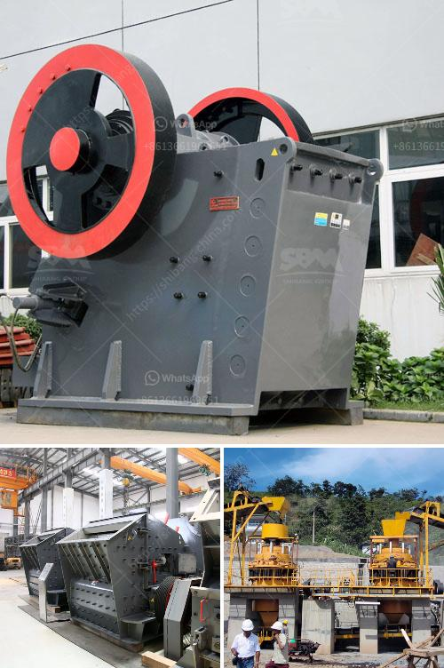

<h3>types and prices of grinding machines</h3>
Grinding machines are industrial tools used to grind or cut metal or other hard, solid materials. These machines come in different types, each with its own specific purpose and use. In this article, we will explore the various types of grinding machines, as well as their prices, to help you understand and make an informed purchase decision.

A bench grinder is a small, tabletop grinding machine that is typically used in home or industrial workshops. It is mounted on a bench or table and consists of two rotating wheels with varying grain sizes for different grinding tasks. Bench grinders are commonly used for sharpening tools, shaping metal, and removing burrs or rust. Prices for bench grinders can range from $50 to $500, depending on the quality, power, and additional features.

Surface grinders are large grinding machines used to produce a smooth, flat surface on a workpiece. They use an abrasive wheel to remove material from the surface of the workpiece, ensuring it is parallel and squared. Surface grinders are commonly used in machine shops, metalworking factories, and toolrooms for precision grinding operations. The prices for surface grinders can start from $500 and go up to $10,000 or more, depending on the size, precision, and automation capabilities.

Cylindrical grinders are used to grind cylindrical surfaces, whether external or internal. They consist of a rotating grinding wheel that moves along the axis of the workpiece, removing material uniformly. Cylindrical grinders are widely used in manufacturing industries for producing high-precision parts, such as shafts, rods, or rollers. Prices for cylindrical grinders can range from $1,000 to $50,000, depending on the size, precision, and automation features.

Centerless grinders are specialized machines used for grinding cylindrical workpieces without the need for centers (chuck or collet). The workpiece is supported by a blade and guided between the grinding wheel and a regulating wheel. Centerless grinders are commonly used for high-volume production applications, such as grinding of rods, bars, or pipes. Prices for centerless grinders can start from $10,000 and go up to $200,000 or more, depending on the size, precision, and automation capabilities.

Tool and cutter grinders are used to sharpen and recondition cutting tools, such as drills, milling cutters, or end mills. They come in various configurations, including bench-mounted, floor-standing, or CNC models. These grinders provide high precision and versatility to re-sharpen or modify various types of cutting tools for different applications. Prices for tool and cutter grinders can range from $2,000 to $50,000 or more, depending on the size, precision, and automation features.

In conclusion, grinding machines are essential tools in many industries for various grinding and cutting tasks. The prices of these machines vary significantly based on their type, size, precision, and additional features. It is crucial to consider your specific requirements and budget before purchasing a grinding machine to ensure you get the right one for your needs.
<h3>Contact us</h3><ul><li><strong>Whatsapp:&nbsp;<a href="https://wa.me/8613661969651">+8613661969651</a></strong></li><li><a href="https://swt.shibang-china.com/?git&amp;zhl&amp;types and prices of grinding machines"><strong>Online Service(chat now)</strong></a></li></ul><h3>Related</h3><ul><li><a href='method statement for a barite mill.md'>method statement for a barite mill</a></li><li><a href='limestone small crusher machine.md'>limestone small crusher machine</a></li><li><a href='made in germany stone crusher.md'>made in germany stone crusher</a></li><li><a href='crusher processing plant malaysia.md'>crusher processing plant malaysia</a></li><li><a href='rock crusher saudi arabia.md'>rock crusher saudi arabia</a></li></ul>