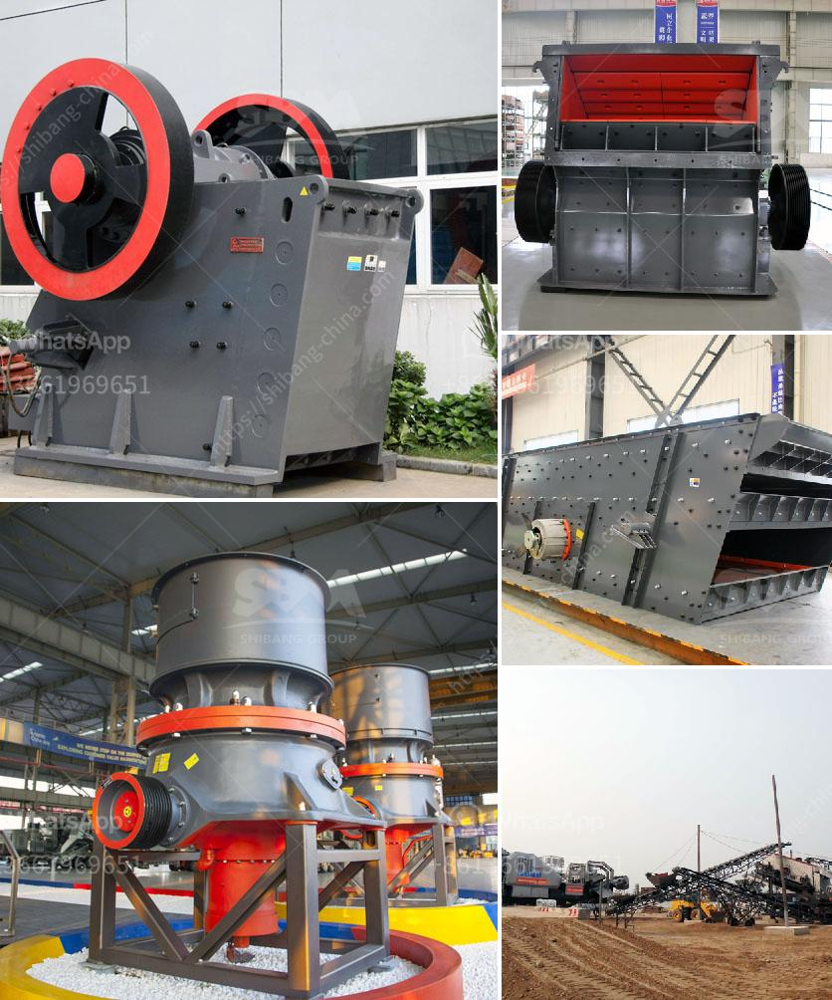

<h3>types of stone crusher and prices</h3>
Stone crusher is a kind of equipment that crushes materials in the form of impact, crushing, and grinding. It can be used for medium and fine crushing of materials with hardness below 350 MPa and moisture content below 8%. In recent years, with the rapid development of the construction industry, the demand for stone products of various sizes increases. The market demand for stone crushers is also growing, which provides strong support for the development of stone crushing industry.

First, we need to understand the nature of the materials. These materials can be crushed by the stone crusher machine like limestone, slag, coke, coal, and various kinds of ore. The machine can be used in the construction, chemical, metallurgical, and other industries. It is suitable for crushing various ores and rocks with different hardness and hardness, and has a reliable structure, high production efficiency, convenient adjustment, and use. Economical and practical, the models are complete and the price is affordable.

There are three main types of stone crusher machines, jaw crushers, impact crushers, and cone crushers. These three types of crushers are commonly used in secondary or tertiary crushing of stone materials. Users can choose a suitable crusher according to their actual needs.

In terms of capacity, there are small, medium, and large rock crushers for sale. Depending on the specific rock hardness, customers can choose a suitable crusher machine. Different types of crushers are used for different purposes. For example, jaw crusher is used for the primary crushing stage, cone crusher is used for the second and third crushing stages, and impact crusher is used for the fourth crushing stage.

Firstly, the stones are usually blasted from the quarry site and then are fed into the primary crusher. The primary crusher breaks the raw materials into coarse particles. The broken materials from the primary crusher are then transported to the secondary crusher for further crushing.

Prices of stone crushers are different based on their different types and capacity. The cost for large-scale machinery and equipment starts at hundreds of thousands of dollars. The medium-sized stone crusher machine prices are generally treated by currency manufacturers. For small and medium-sized stone crushers, the price of the machine is generally lower.

There are three main types of crusher machines, semi-mobile crusher, tracked crusher, and fixed crusher. Every type of crusher has different features. Semi-mobile crushers are suitable for those projects that are not long-term and require small mobilization distance, while tracked crushers are generally used in larger-scale crushing projects. Fixed crushers are the main equipment of a complete stone production line.

Generally, a fixed crusher is selected as the preliminary crushing system and the crushing efficiency is high. The material characteristics of the production line are taken into account as much as possible, and the crushing equipment is selected as much as possible. The cone crushers have many advantages, such as high efficiency, small energy consumption, and uniform product particle size.

So, what kind of crusher is suitable for crushing material of small particle size? It depends on the requirements of the production line, lean more about the stone crusher machine! If you have any concerns about your stone crusher machine prices, please contact us, our professional engineers will provide you the most professional and cost-effective solution.
<h3>Contact us</h3><ul><li><strong>Whatsapp:&nbsp;<a href="https://wa.me/8613661969651">+8613661969651</a></strong></li><li><a href="https://swt.shibang-china.com/?git&amp;zhl&amp;types of stone crusher and prices"><strong>Online Service(chat now)</strong></a></li></ul><h3>Related</h3><ul><li><a href='quarry crusher machine.md'>quarry crusher machine</a></li><li><a href='biggest crucher in kenya.md'>biggest crucher in kenya</a></li><li><a href='cost of stone crusher.md'>cost of stone crusher</a></li><li><a href='ball mills as size reduction equipment.md'>ball mills as size reduction equipment</a></li><li><a href='rock crusher production screen mesh.md'>rock crusher production screen mesh</a></li></ul>