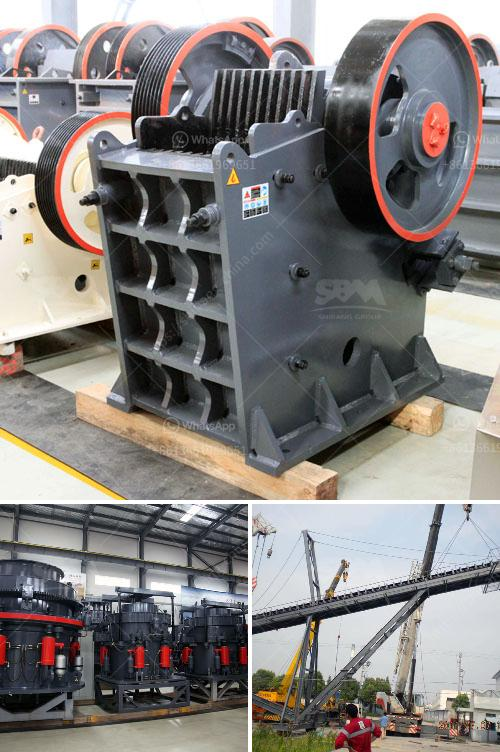

<h3>types of vibratory screens</h3>
Vibratory screens are an essential tool in a wide variety of industries, including mining, manufacturing, and construction. These screens are used to separate materials based on their size, shape, and density. They employ vibration and gravity to move and separate particles, ensuring an efficient and accurate screening process. In this article, we will explore the different types of vibratory screens and their applications.

Inclined vibrating screens are the most common type of vibrating screens. They are known for their high screening efficiency and large processing capacity. These screens have a sloping surface, usually with a steep incline, which allows materials to be quickly and efficiently separated. They are often used in applications where high throughput and accurate separation are crucial, such as mining and aggregate processing.

Horizontal vibrating screens, also known as banana screens, are designed with a horizontal or near-horizontal screen surface. This unique design allows the material to spread across the entire width of the screen, improving screening efficiency and maximizing the available screening area. They are commonly used in applications where the material needs to be screened at a relatively shallow angle or when the material contains a high percentage of moisture.

High-frequency vibrating screens are designed to produce fine particles by vibrating the screen at very high frequencies. This generates high accelerations and prevents particles from sticking to the screen surface. These screens are often used in applications where precise particle sizes are required, such as in the pharmaceutical and chemical industries.

Dewatering vibrating screens are specifically designed to remove water from the material being screened. These screens have a high inclination angle, and their main purpose is to reduce the moisture content of the material. They are commonly used in applications such as sand dewatering, coal preparation, and aggregate washing.

Low-profile vibrating screens, also known as rotary screens, are used in applications where space is limited. These screens have a compact design and can be easily integrated into existing processing systems. They are often used in food processing, pharmaceuticals, and other industries where precise separation is required in a small footprint.

In conclusion, vibratory screens play a vital role in various industries by efficiently and accurately separating materials based on their size, shape, and density. The different types of vibratory screens available offer a wide range of applications, from high throughput mining operations to fine particle separation in pharmaceutical manufacturing. By understanding the specific requirements of each application, businesses can choose the most suitable vibratory screen to optimize their operations and achieve their desired screening outcomes.
<h3>Contact us</h3><ul><li><strong>Whatsapp:&nbsp;<a href="https://wa.me/8613661969651">+8613661969651</a></strong></li><li><a href="https://swt.shibang-china.com/?git&amp;zhl&amp;types of vibratory screens"><strong>Online Service(chat now)</strong></a></li></ul><h3>Related</h3><ul><li><a href='grinding machines sales in namibia.md'>grinding machines sales in namibia</a></li><li><a href='price hammer crusher nigeria.md'>price hammer crusher nigeria</a></li><li><a href='belt cost conveyor.md'>belt cost conveyor</a></li><li><a href='the roller grinding mill.md'>the roller grinding mill</a></li><li><a href='small mobile rock pulverizer.md'>small mobile rock pulverizer</a></li></ul>