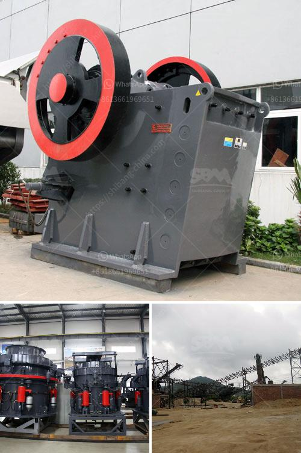

<h3>typical roll and roll mill</h3>
A rolling mill, also known as a roll mill, is an industrial machine that processes materials such as metals to produce a uniform thickness or shape. It plays a crucial role in the manufacturing industry, particularly in the metalworking sector. This article will delve into the typical roll and roll mill, exploring their functions, components, and applications.

Rolls are an essential part of the rolling mill, as they are responsible for shaping and forming the material being processed. They come in various sizes and types, depending on the specific requirements of the operation. Common types of rolls include flat, grooved, and profiled rolls. Flat rolls are utilized for sheet metal rolling, while grooved rolls are used for shaping rods, wires, and tubes. Profiled rolls, on the other hand, are designed to create specific cross-sectional shapes on the rolled material.

A typical roll mill consists of several components that work together to achieve effective and efficient rolling operations. These components include the rolls, the bearings, the housing, and the drive mechanism. The rolls are mounted on bearings and positioned within a housing that provides support and protection. The drive mechanism, usually an electric motor, powers the rolls, providing the necessary force for the rolling process. Additionally, some roll mills include advanced features like automation systems and hydraulic controls for improved precision and productivity.

Roll mills find a wide range of applications in various industries. They are commonly used in metalworking processes, such as hot and cold rolling of steel, aluminum, and other metals. In these processes, roll mills can help to reduce the thickness or alter the shape of the material to meet specific manufacturing requirements. Roll mills are also employed in the production of products like paper, plastics, and textiles, where they assist in shaping and forming these materials.

The operation of a roll mill involves feeding the material between the rolls, which then compress and exert pressure on the material. This pressure causes the material to deform and change its shape or thickness. The speed at which the rolls rotate and the positioning of the rolls can be adjusted depending on the desired outcome. The material may pass through the roll mill multiple times to achieve the desired final shape or thickness.

In conclusion, roll mills are a vital component in the manufacturing industry, particularly in metalworking processes. They enable the shaping and forming of various materials, delivering uniform thickness and precise shapes. With their numerous applications across different industries, roll mills play a crucial role in the production of everyday products we use. As technology continues to advance, we can expect to see further enhancements in roll mills, leading to improved efficiency and quality in manufacturing processes.
<h3>Contact us</h3><ul><li><strong>Whatsapp:&nbsp;<a href="https://wa.me/8613661969651">+8613661969651</a></strong></li><li><a href="https://swt.shibang-china.com/?git&amp;zhl&amp;typical roll and roll mill"><strong>Online Service(chat now)</strong></a></li></ul><h3>Related</h3><ul><li><a href='conveyor belt for fly ash.md'>conveyor belt for fly ash</a></li><li><a href='sand sieving machine by vibrating system chennai.md'>sand sieving machine by vibrating system chennai</a></li><li><a href='talc grinding plant.md'>talc grinding plant</a></li><li><a href='quartz manufacturing plant.md'>quartz manufacturing plant</a></li><li><a href='materials used to make a talcum powder.md'>materials used to make a talcum powder</a></li></ul>