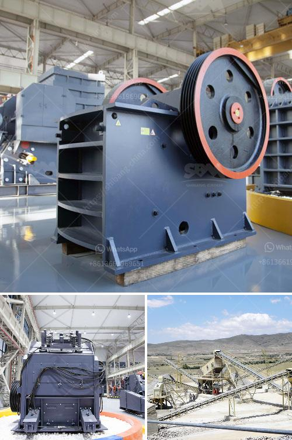

<h3>uk quarry machinery manufacturers</h3>
Quarrying is a vital industry in the UK, providing essential materials to a wide range of sectors including construction, infrastructure, and manufacturing. To meet the growing demand for high-quality aggregates and materials, quarry machinery manufacturers play a crucial role in ensuring efficient and effective operations in quarries across the country.

The UK boasts a strong reputation for its quarry machinery manufacturers, who are known for their innovation, reliability, and commitment to quality. These manufacturers produce a diverse range of machinery and equipment specifically designed to meet the unique challenges of the quarrying industry.

One of the key areas of focus for quarry machinery manufacturers is improving efficiency and productivity in the quarries. This includes the development of advanced machinery that can extract materials more effectively, such as excavators, loaders, and dump trucks. These machines are designed to handle heavy loads and operate in tough conditions, ensuring maximum output and minimizing downtime.

Another important aspect of quarry machinery is the processing and handling of materials. This includes crushers, screens, and conveyors that are essential for breaking down and sorting the extracted materials. Manufacturers employ cutting-edge technologies to ensure that these machines are highly efficient, durable, and capable of handling large volumes of materials.

Environmental considerations are also at the forefront of UK quarry machinery manufacturers' priorities. They strive to develop machinery that minimizes environmental impact, such as incorporating technologies for dust suppression and noise reduction. Additionally, manufacturers work closely with quarry operators to design and implement sustainable solutions that promote responsible quarrying practices and minimize environmental footprints.

Moreover, safety is a paramount concern for quarry machinery manufacturers. They invest heavily in the development of machinery with advanced safety features, including emergency-stop systems, anti-collision technologies, and operator training programs. These measures aim to protect the workers and improve overall safety standards in quarries.

The UK's quarry machinery manufacturers are well-positioned to meet the demands of the industry both domestically and globally. They have a strong track record of exporting their machinery to various countries, benefiting from their reputation for quality and reliability. Additionally, manufacturers actively participate in industry events and collaborate with research institutions to stay abreast of the latest innovations and technologies.

Furthermore, manufacturers also provide comprehensive after-sales support, including maintenance, spare parts, and technical assistance. This ensures that quarry operators can rely on their machinery for extended periods, maximizing their return on investment and minimizing downtime.

In conclusion, the UK quarry machinery manufacturers play a vital role in the success of the quarrying industry. Their commitment to innovation, quality, and sustainability has made them leaders in the field. With their expertise and wide range of specialized machinery, they continue to contribute to the growth and development of the quarrying sector in the UK and beyond.
<h3>Contact us</h3><ul><li><strong>Whatsapp:&nbsp;<a href="https://wa.me/8613661969651">+8613661969651</a></strong></li><li><a href="https://swt.shibang-china.com/?git&amp;zhl&amp;uk quarry machinery manufacturers"><strong>Online Service(chat now)</strong></a></li></ul><h3>Related</h3><ul><li><a href='small stone brick crusher.md'>small stone brick crusher</a></li><li><a href='coal mill company in srilanka.md'>coal mill company in srilanka</a></li><li><a href='mobile fine jaw crusher at saudi arabia.md'>mobile fine jaw crusher at saudi arabia</a></li><li><a href='crusher in sri lanka.md'>crusher in sri lanka</a></li><li><a href='rock crusher machine.md'>rock crusher machine</a></li></ul>