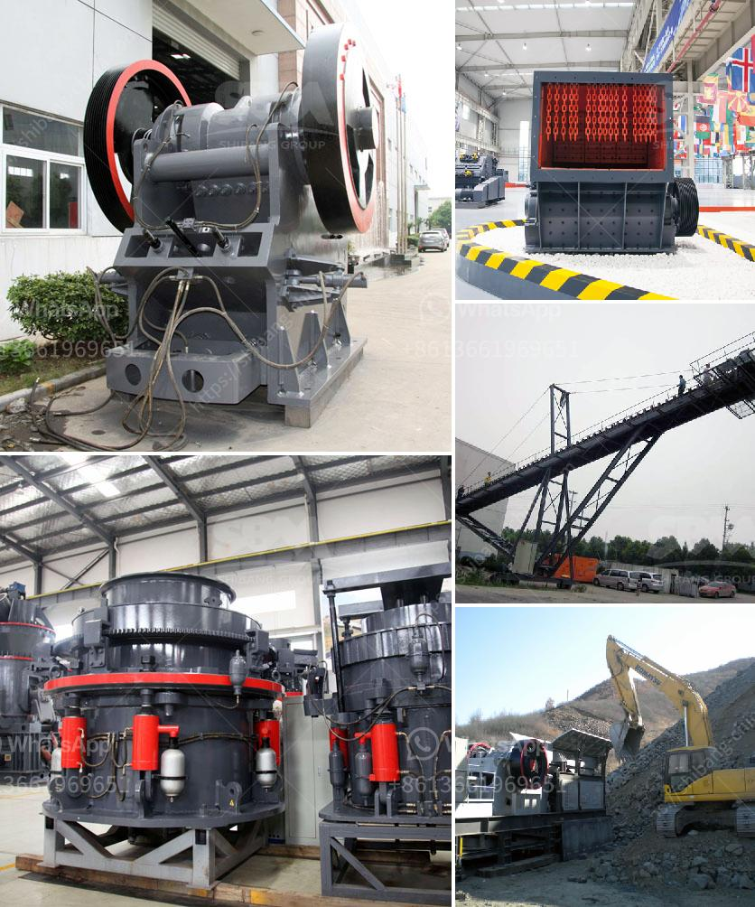

<h3>ultra fine grinder feeding size</h3>
The ultra fine grinder is a machine used to crush various types of materials into fine particles. It is commonly used in industries such as mining, metallurgy, cement, chemical, and others. One important factor that affects the performance of the ultra fine grinder is the feeding size. In this article, we will explore the significance of feeding size and its impact on the operation of the ultra fine grinder.

Feeding size refers to the maximum size of the raw material that can be fed into the grinder. It plays a crucial role in determining the efficiency and output of the machine. A proper feeding size ensures that the grinder operates at its optimum capacity, producing the desired particle size distribution.

When determining the feeding size, several factors must be taken into consideration. These include the properties of the raw material, the capacity of the grinder, and the desired particle size of the final product. For example, if the raw material is too large, it may cause blockages or damage to the machine. Conversely, if the raw material is too small, the grinder may not operate efficiently, resulting in low productivity.

The feeding size of the ultra fine grinder typically ranges from a few millimeters to several centimeters. However, it is important to note that the optimal feeding size may vary depending on the specific application and the requirements of the grinding process. Therefore, it is crucial to carefully determine the appropriate feeding size for each individual case.

To achieve the desired particle size distribution, some materials may require pre-processing before being fed into the ultra fine grinder. Pre-processing techniques such as crushing or grinding can be utilized to reduce the size of the raw material to a suitable range. This ensures that the material can be effectively processed by the grinder, resulting in a consistent and high-quality final product.

In addition to the feeding size, the type and condition of the raw material also affect the performance of the ultra fine grinder. Hard and abrasive materials may require more energy and time to be processed, which can impact the overall efficiency of the grinding operation. Conversely, softer materials may be more easily ground, requiring less power and time.

In conclusion, the feeding size is a critical parameter that determines the performance of the ultra fine grinder. It affects the efficiency, capacity, and final product quality of the machine. By carefully considering the properties of the raw material and the desired particle size distribution, the appropriate feeding size can be determined. This ensures that the grinder operates at its optimum capacity, producing consistent and high-quality fine particles.
<h3>Contact us</h3><ul><li><strong>Whatsapp:&nbsp;<a href="https://wa.me/8613661969651">+8613661969651</a></strong></li><li><a href="https://swt.shibang-china.com/?git&amp;zhl&amp;ultra fine grinder feeding size"><strong>Online Service(chat now)</strong></a></li></ul><h3>Related</h3><ul><li><a href='crusher machine price list.md'>crusher machine price list</a></li><li><a href='enquiry about crusher.md'>enquiry about crusher</a></li><li><a href='sand washing machine zenith.md'>sand washing machine zenith</a></li><li><a href='calcium carbonate machine.md'>calcium carbonate machine</a></li><li><a href='price and sales of quarry crusher in nigeria.md'>price and sales of quarry crusher in nigeria</a></li></ul>