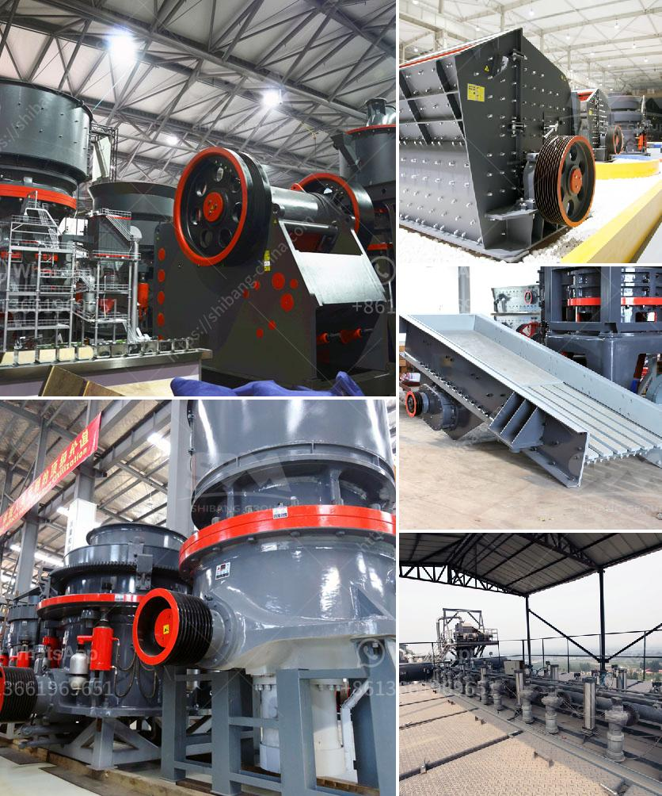

<h3>ultrafine ball mills machine</h3>
Ball mills are widely used in materials grinding and processing in metallurgy, building materials, chemical industry, mining and other fields. They are suitable for grinding various ores and other materials, such as cement, lime, quartz sand, aluminum slag, iron ore, copper ore, gold ore, coke, coal gangue, coal, gypsum, slag, fly ash, etc.

One of the main challenges in grinding and processing is to obtain ultrafine particles. Ultrafine grinding technology, which involves the use of specially designed ultrafine ball mills, has become increasingly popular due to its ability to achieve ultrafine particles.

Ultrafine ball mills are mainly used for grinding materials with hardness not exceeding 7 and humidity below 6%, such as quartz, feldspar, calcite, talc, barite, fluorite, iron ore, copper ore, gold ore, cement clinker, glass, etc. It is the ideal equipment for making fine and ultrafine powder.

The ultrafine ball mill machine has the advantages of high grinding efficiency, low energy consumption, large output, continuous production, adjustable product fineness, and easy installation and maintenance. It also has the advantages of small occupation area, suitable for grinding and processing small batch production.

In terms of structure, ultrafine ball mills usually consist of a cylindrical barrel with a certain length and diameter, grindable media (steel balls, ceramic beads, or pebbles) inside the barrel, and a motor that drives the barrel to rotate. The materials to be ground are fed into the barrel from one end and discharged from the other end through the overflow and continuous feeding ports.

The ultrafine ball mills machine can be used for both wet and dry grinding. The wet grinding can be equipped with a classifier, which can adjust the fineness of the finished product according to the needs. The dry grinding generally adopts the method of air classification, which can control the particle size of the finished product by adjusting the speed of the air classifier wheel.

The ultrafine ball mills machine are widely used in various industries. In the mining industry, it is used for grinding various ores and rocks, such as iron ore, gold ore, copper ore, etc. In the building materials industry, it is mainly used for grinding cement clinker, limestone, gypsum, etc. In the chemical industry, it is used for grinding various chemical materials, such as barite, talc, kaolin, etc.

In conclusion, ultrafine ball mills machine is a versatile grinding equipment that can grind various materials into ultrafine particles. It has the advantages of high grinding efficiency, low energy consumption, large output, continuous production, easy installation and maintenance. It is widely used in metallurgy, building materials, chemical industry, mining and other fields. With the continuous improvement of ultrafine grinding technology, ultrafine ball mills machine will play a more important role in the future.
<h3>Contact us</h3><ul><li><strong>Whatsapp:&nbsp;<a href="https://wa.me/8613661969651">+8613661969651</a></strong></li><li><a href="https://swt.shibang-china.com/?git&amp;zhl&amp;ultrafine ball mills machine"><strong>Online Service(chat now)</strong></a></li></ul><h3>Related</h3><ul><li><a href='work principle of a hammer mill.md'>work principle of a hammer mill</a></li><li><a href='quartz crushing plant german tecnology.md'>quartz crushing plant german tecnology</a></li><li><a href='cost of crusher run in las vegas.md'>cost of crusher run in las vegas</a></li><li><a href='marble crusher machinery manufacturer.md'>marble crusher machinery manufacturer</a></li><li><a href='mineral grinding mill unit.md'>mineral grinding mill unit</a></li></ul>