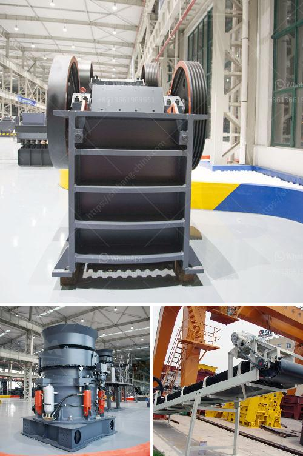

<h3>used 200 tph stone crusher sale sale in india</h3>
India’s mineral resources are highly rich and diverse. With the rapid economic development, India’s demand for stone crusher is increasing significantly. Each year, several billion tonnes of gravel, cobblestone and boulder are produced globally. India accounts for a significant percentage of the global market share in the stone crushing industry.

200 tph stone crushers are commonly used as primary crushers for crushing various hard and abrasive materials. The maximum feed size is about 800 mm, and the discharging size can be adjusted between 35 and 50 mm. The production capacity can reach 200 tph.

The stone crushers are widely used in various industries such as mining, construction, road and railway construction, building construction, water conservancy and chemical industry, etc. They are suitable for crushing all kinds of ores and rocks with compressive strength less than 320 MPa.

When choosing a stone crusher, you need to consider the size of your intended project and the raw materials you will use. Different stone crushers have different sizes, shapes, and configurations. The cost of a stone crusher varies greatly depending on the type and capacity.

In India, stone crushers are mainly located in the states of Rajasthan, Uttar Pradesh, Haryana, Madhya Pradesh, and Andhra Pradesh. The major equipment used in a stone crushing plant includes vibrating feeder, jaw crusher, impact crusher, vibrating screen, belt conveyor, and centralized electric control.

Stone crushers can be categorized into primary, secondary, and tertiary crushers depending on their purpose. Primary crushers are used to reduce large rocks into smaller rocks and gravel for further processing. Secondary crushers are used to break down the materials into required sizes, while tertiary crushers refine the crushed materials.

Used 200 tph stone crushers are generally used for crushing limestone, granite, basalt, river stone and other hard materials. They are known for their high efficiency, low maintenance, and reliable operation. They are capable of producing aggregates of different sizes with uniform particle shape.

Before buying a used 200 tph stone crusher, it is important to check the condition of the equipment and the seller’s reputation. This can be done by visiting the seller in person or through online research and reviews. Additionally, it is recommended to have a professional inspect the equipment to ensure its proper functioning and maintenance.

The price of a used 200 tph stone crusher varies depending on various factors such as the seller’s location, the condition of the equipment, the demand for the product, and the market competition. However, compared to new stone crushers, the prices of used ones are cheaper.

In conclusion, the demand for used 200 tph stone crushers is increasing in India. India has a rich mineral resources and stone crushing industry plays an important role in India’s economic development. The used 200 tph stone crushers are durable, reliable, and with high operational efficiency. Choosing the right stone crusher and conducting a thorough inspection can ensure a smooth and successful purchase.
<h3>Contact us</h3><ul><li><strong>Whatsapp:&nbsp;<a href="https://wa.me/8613661969651">+8613661969651</a></strong></li><li><a href="https://swt.shibang-china.com/?git&amp;zhl&amp;used 200 tph stone crusher sale sale in india"><strong>Online Service(chat now)</strong></a></li></ul><h3>Related</h3><ul><li><a href='pulverizer crusher machine for coal.md'>pulverizer crusher machine for coal</a></li><li><a href='grinding balls in tanzania.md'>grinding balls in tanzania</a></li><li><a href='stone crushers in bennta in bogota.md'>stone crushers in bennta in bogota</a></li><li><a href='low cost jaw crusher price.md'>low cost jaw crusher price</a></li><li><a href='used stone crushers for sale germany.md'>used stone crushers for sale germany</a></li></ul>