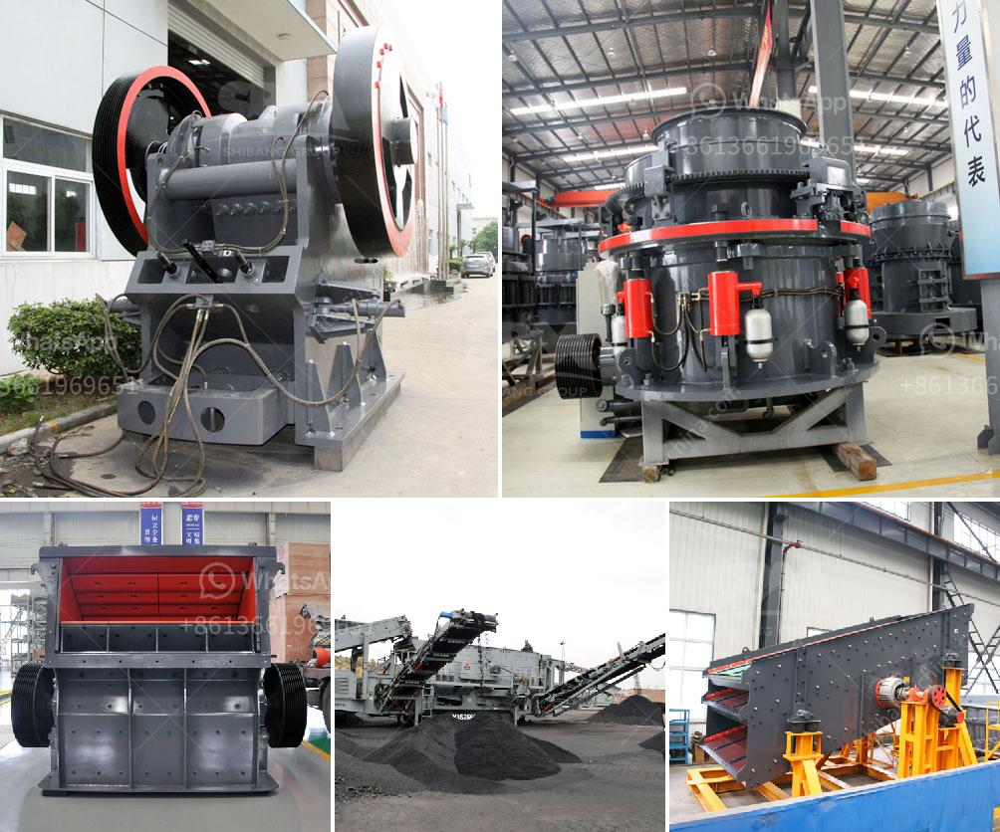

<h3>used 900 cone crusher for sale</h3>
If you are in the market for a used 900 cone crusher for sale, you have come to the right place. The cone crusher is an essential piece of equipment in many industries such as mining and construction. It is designed to crush stones and rocks efficiently and quickly. If you are looking to add a reliable and efficient crusher to your operation, a used 900 cone crusher can be a great option.

There are several benefits to purchasing a used crusher, especially if you are on a tight budget. The first advantage is cost savings. Used equipment is usually priced much lower than new models, making it a more affordable option for many businesses. This means that you can get a high-quality cone crusher at a fraction of the cost of a new one. Additionally, many used crushers are still in great condition and can perform just as well as a new machine.

Another advantage of purchasing a used 900 cone crusher is the availability. As they are a popular choice in many industries, there are often several used models available on the market. This gives you the freedom to compare different options and choose the one that best suits your needs. You can also easily find spare parts for a used crusher, making maintenance and repairs easier.

When considering a used 900 cone crusher for sale, it is essential to take a closer look at its condition. A well-maintained crusher can offer excellent performance and longevity. It is advisable to ask for detailed maintenance records and any available service history to determine how well the crusher has been taken care of. Additionally, it is crucial to inspect the machine personally or hire a professional to thoroughly evaluate its condition. Checking the overall appearance, the wear and tear of the parts, and testing its functionality are essential steps before making a purchase.

It is also important to consider the specific requirements of your project when choosing a crusher. A used 900 cone crusher can offer various specifications, such as different crushing capacities and settings. Make sure to evaluate your needs and select a crusher that can effectively handle the size and type of material you are working with. This will help ensure optimal performance and productivity.

In conclusion, purchasing a used 900 cone crusher for sale can be a smart investment for businesses in need of a reliable crushing solution. The cost savings, availability, and potential for high performance make it an attractive option. However, it is crucial to thoroughly inspect the condition of the machine before closing the deal. By considering your specific requirements and taking the necessary precautions, you can find a used crusher that meets your needs and boosts your operational efficiency.
<h3>Contact us</h3><ul><li><strong>Whatsapp:&nbsp;<a href="https://wa.me/8613661969651">+8613661969651</a></strong></li><li><a href="https://swt.shibang-china.com/?git&amp;zhl&amp;used 900 cone crusher for sale"><strong>Online Service(chat now)</strong></a></li></ul><h3>Related</h3><ul><li><a href='calcium carbonated crusher mill china.md'>calcium carbonated crusher mill china</a></li><li><a href='jaw crusher saudi price.md'>jaw crusher saudi price</a></li><li><a href='ball mill for sale cagayan.md'>ball mill for sale cagayan</a></li><li><a href='production process clinker zurich switzerland.md'>production process clinker zurich switzerland</a></li><li><a href='bauxite processing crusher.md'>bauxite processing crusher</a></li></ul>