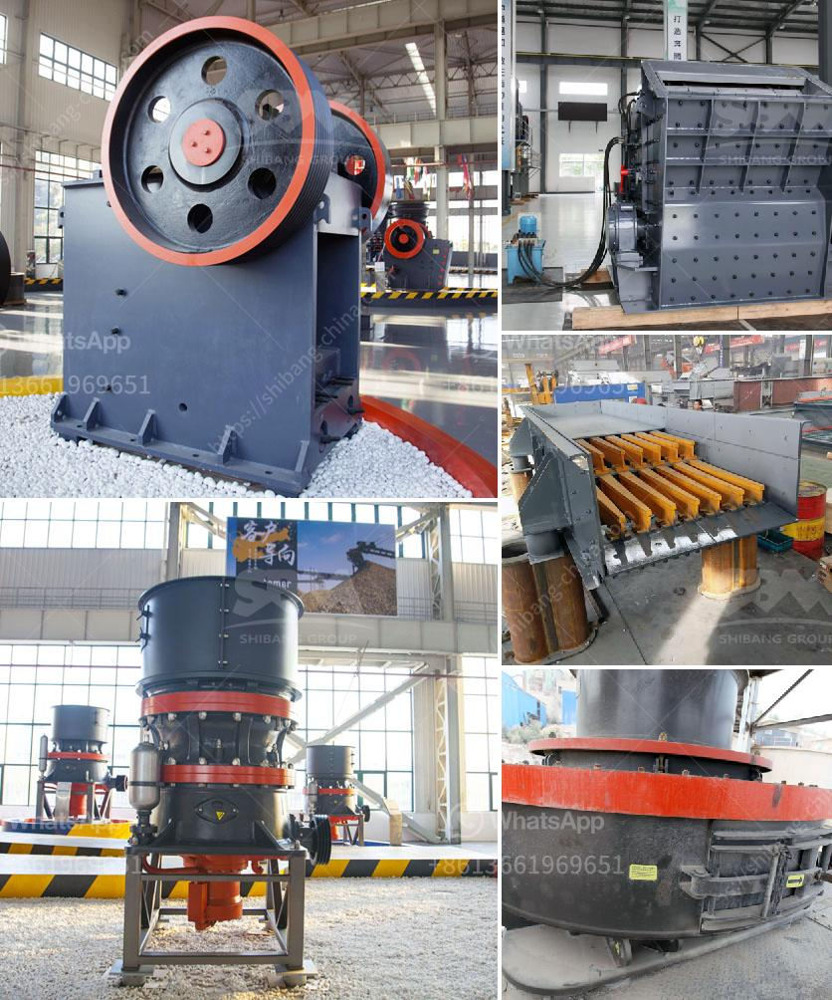

<h3>used ball mill for calcium carbonate sell india</h3>
Calcium carbonate is an inorganic compound commonly known as limestone. It is a white, odorless powder with a high melting point of 825°C. Calcium carbonate is insoluble in water and alcohol but soluble in acid. With the development of industry, calcium carbonate has a wide range of applications and plays an important role in many industries such as construction, paint, rubber, plastics, ceramics, papermaking, and more. 

To produce calcium carbonate powder, calcium carbonate ore or limestone is ground using a ball mill. There are many types of ball mills available in the market, which are used to grind different materials. However, the most commonly used ball mill for calcium carbonate is the horizontal ball mill, which has cylindrical rotor paddles that rotate in opposite directions.

In the market, there are two common types of ball mills used for calcium carbonate production line: dry ball mill and wet ball mill. Dry ball mill is mainly used for single-stage fine grinding and coarse grinding of calcium carbonate. Wet ball mill is used for the precipitation of heavy calcium carbonate while dry ball mill is an investment product that is used for calcium carbonate grinding with less water. It is used in dry production for efficient, energy-saving, and environmentally-friendly production of calcium carbonate powder.

Calcium carbonate ball mill has a wide range of applications and can process calcium carbonate ultrafine powder with different finenesses. Under the same fineness of finished products and motor power, the output of calcium carbonate ball mill is 10% higher than airflow mill and stirring mill, and the energy consumption of calcium carbonate ball mill is only 5% of that of airflow mill.

The output and fineness of the calcium carbonate ball mill produced by Daswell machinery are comparable to those of vertical mills, and the production capacity is 20% higher than that of other suppliers. Our equipment is qualified, reliable, and durable, with an average annual failure rate of less than 1%. Daswell ball mill machine for calcium carbonate can also be customized according to customer requirements.

With years of experience in the field of calcium carbonate grinding, we have become a leading manufacturer and supplier of calcium carbonate ball mill in India. Our product quality is excellent and our service is comprehensive. With an extensive installed base, we have designed dozens of whole production lines for customers from different fields. If you are interested in our calcium carbonate ball mill, please contact us for detailed consultation and quotation.

In conclusion, the used ball mill for calcium carbonate sell India is in high demand and there are many suppliers available. Daswell machinery is a professional manufacturer and supplier of mineral processing plants, such as calcium carbonate grinding plant. With guaranteed quality and after-sale service, Daswell machinery has successfully installed several calcium carbonate plants in India.
<h3>Contact us</h3><ul><li><strong>Whatsapp:&nbsp;<a href="https://wa.me/8613661969651">+8613661969651</a></strong></li><li><a href="https://swt.shibang-china.com/?git&amp;zhl&amp;used ball mill for calcium carbonate sell india"><strong>Online Service(chat now)</strong></a></li></ul><h3>Related</h3><ul><li><a href='price for ball mills.md'>price for ball mills</a></li><li><a href='toner production line suppliers.md'>toner production line suppliers</a></li><li><a href='technical specification limestone milling system.md'>technical specification limestone milling system</a></li><li><a href='grinding silica sand to get 325 mesh product.md'>grinding silica sand to get 325 mesh product</a></li><li><a href='vsi crusher manufacturer.md'>vsi crusher manufacturer</a></li></ul>