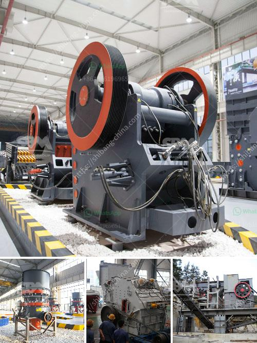

<h3>used ballast crusher in uk</h3>
Ballast refers to stones or rocks that are used in the construction of railway tracks. It plays a crucial role in supporting the tracks, as well as keeping them in place. It is widely used in the construction industry for a variety of purposes, including road construction, foundation walls, and driveways. The demand for ballast is high, and as a result, there is a significant market for used ballast crushers in the UK.

A ballast crusher is a machine that is used to crush stones or rocks into smaller pieces. The main purpose of this process is to convert the rocks into aggregate that can be used in construction projects. Ballast crushing is necessary for railway tracks, as they provide the track with drainage and support. It also prevents the tracks from becoming uneven, which can lead to accidents.

In the UK, ballast crushers are commonly used to produce crushed stones for road construction. The machines come in different models and sizes, ranging from small handheld devices to larger industrial-grade crushers. With the advancement in technology, there has been an increase in the efficiency and effectiveness of ballast crushers, making them more reliable and easier to use.

Used ballast crushers in the UK offer a cost-effective alternative to new machines. With the high costs of transportation, importing a brand-new ballast crusher may not be economically feasible for many construction companies. Additionally, buying a used machine allows companies to have access to high-quality equipment at a fraction of the price.

When looking for a used ballast crusher in the UK, it is important to consider several factors. Firstly, one should determine the type and size of crusher that is needed for their specific project. This will depend on the size of the rocks or stones that need to be crushed, as well as the desired output size.

Secondly, it is crucial to buy from a reputable seller. This can be achieved by doing thorough research on the seller, checking their reputation, and reading customer reviews. A trusted seller will provide accurate information about the condition of the machine, any maintenance or repair history, as well as offer warranty options.

Lastly, before purchasing a used ballast crusher, it is advisable to inspect the machine in person. This will help identify any potential issues, such as worn-out parts or malfunctioning components. It is also recommended to test the machine to ensure it is in good working condition and meets the specific requirements of the project.

In conclusion, used ballast crushers in the UK provide a cost-effective solution for construction companies in need of crushed stones for various projects. These machines offer high-quality aggregate production at a fraction of the cost of new crushers. However, it is essential to do thorough research and inspection before making a purchase to ensure the machine’s reliability and suitability for the project.
<h3>Contact us</h3><ul><li><strong>Whatsapp:&nbsp;<a href="https://wa.me/8613661969651">+8613661969651</a></strong></li><li><a href="https://swt.shibang-china.com/?git&amp;zhl&amp;used ballast crusher in uk"><strong>Online Service(chat now)</strong></a></li></ul><h3>Related</h3><ul><li><a href='type of ball mill.md'>type of ball mill</a></li><li><a href='how much crusher plant cost.md'>how much crusher plant cost</a></li><li><a href='price of mobile crusher.md'>price of mobile crusher</a></li><li><a href='concrete grinder diamatic.md'>concrete grinder diamatic</a></li><li><a href='ball mill grinding manufacturer in india.md'>ball mill grinding manufacturer in india</a></li></ul>