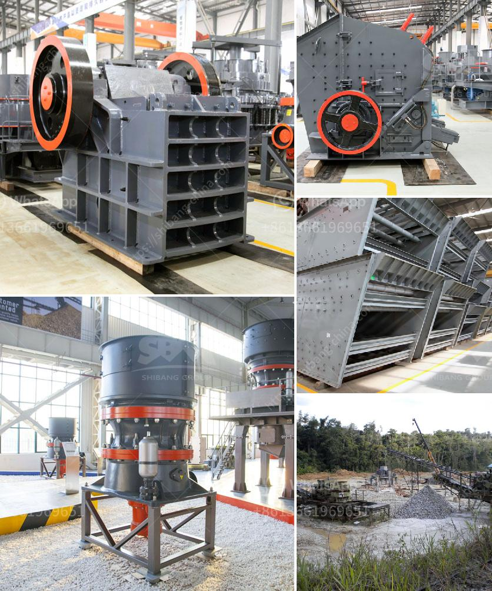

<h3>used basalt stone jaw crusher for sale</h3>
Used basalt stone jaw crusher for sale, as one of the commonly used production lines, this stone crushing production line can process more than 200 kinds of materials, such as pebbles, granite, bluestone, iron ore, limestone, quartz and so on.

Basalt is a relatively hard material with a crushing wear factor of about 3-5, making it one of the higher wear-resistant materials on the market. The jaw crusher has a feed size of 120-1500mm, crushing capacity of 1-2200t/h, and a compressive strength of up to 320MPa. It is suitable for primary crushing of various ores and bulk materials, with its simple structure and reliable performance.

The used basalt stone jaw crusher for sale are generally used for crushing recycled materials or resources that have not been extensively reprocessed. The main reason for recycling is the concern of unavailability of natural resources. In addition, recycling also allows a reprocessing of products, which can greatly reduce resource consumption and waste generation, and has a positive effect on environmental protection.

Compared with the traditional crushing production line, the used basalt stone jaw crusher for sale is simpler in structure and easier to operate. The cost of the production line is reduced, so the economic benefits of basalt stone can be fully realized. The investment in the equipment is small and the production capacity is high, which can bring considerable profits to the users.

In terms of installation and maintenance, the used basalt stone jaw crusher for sale are easy to install and maintain. It only requires ordinary tools for operation and can be completed in a short time, saving a lot of installation and maintenance costs. In addition, the jaw crusher has a simple structure, and the wearing parts are easy to replace, which also greatly reduces the maintenance cost.

Used basalt stone jaw crusher for sale also has fine crushing effect. The feed grain size of the machine is less than 1500mm and the product size is less than 300mm. It can be used for medium and fine crushing operations, which not only reduces the investment cost of customers, but also improves the production efficiency and returns the material to the traditional crushing production line.

In summary, the used basalt stone jaw crusher for sale has the characteristics of large crushing ratio, simple structure, reliable operation, simple maintenance and low operation cost. The investment cost of crushing equipment is low, the wear resistance of wearing parts is high, and the failure rate of equipment is low. It is an ideal choice for large and medium-sized basalt crushing production lines.

As the market demand for basalt stone continues to increase, the used basalt stone jaw crusher for sale has become more and more popular. With the continuous advancement of technology and the increasing maturity of equipment, the development prospects of the used basalt stone jaw crusher for sale are promising. It is believed that there will be more market space for the used basalt stone jaw crusher for sale in the future.
<h3>Contact us</h3><ul><li><strong>Whatsapp:&nbsp;<a href="https://wa.me/8613661969651">+8613661969651</a></strong></li><li><a href="https://swt.shibang-china.com/?git&amp;zhl&amp;used basalt stone jaw crusher for sale"><strong>Online Service(chat now)</strong></a></li></ul><h3>Related</h3><ul><li><a href='calculation of crushing plant.md'>calculation of crushing plant</a></li><li><a href='material composition for coal screen.md'>material composition for coal screen</a></li><li><a href='process of crushing stones.md'>process of crushing stones</a></li><li><a href='coal mill price 5 tph.md'>coal mill price 5 tph</a></li><li><a href='used stone crusher mini plant india.md'>used stone crusher mini plant india</a></li></ul>