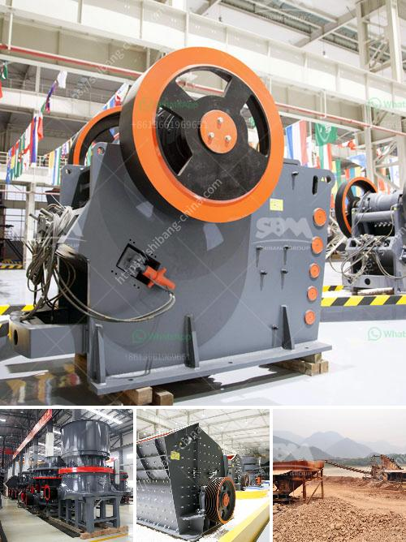

<h3>used coal wash plant canada for sale</h3>
As the energy sector evolves towards cleaner and more sustainable alternatives, the demand for coal production has considerably declined. Consequently, coal wash plants that were once critical for coal processing are now being phased out in many countries, including Canada. However, these used coal wash plants present a unique investment opportunity for individuals or organizations seeking cost-effective and efficient solutions for various applications. This article explores the advantages of purchasing used coal wash plants in Canada, providing an overview of their potential benefits.

One of the primary advantages of acquiring a used coal wash plant in Canada is its affordability. Unlike purchasing new and expensive equipment, buying a pre-owned coal wash plant significantly reduces upfront costs. This cost savings allows potential buyers to allocate funds towards other essential investments or operational expenses, ensuring financial sustainability.

Used coal wash plants offer an added advantage of being versatile and adaptable to different coal processing requirements. Buyers can modify and retrofit these plants to suit their specific needs, thereby reducing the need for additional investments in new equipment. From coal washing, separation, and recovery processes to water recycling systems, these plants can be tailored to maximize efficiency and productivity in various coal-related applications.

By purchasing a used coal wash plant, buyers actively contribute to environmental sustainability. The acquisition of pre-owned equipment reduces the demand for new coal processing machinery, consequently limiting the environmental impact associated with their production. Furthermore, modern coal wash plants have advanced technology and equipment that can enhance efficiency, minimize waste generation, and reduce water consumption, aligning with the industry's growing focus on sustainable practices.

Investing in a used coal wash plant in Canada can prove to be a wise and sustainable move for those seeking an affordable and efficient solution for coal processing. These plants offer cost-effective benefits, customization options, and a reduced environmental footprint. As the coal industry transitions towards cleaner alternatives, repurposing and optimizing existing assets become crucial steps towards a greener and more sustainable energy sector. Thus, exploring the market for used coal wash plants in Canada presents an excellent opportunity for individuals or organizations looking to contribute positively to the industry's transformation.
<h3>Contact us</h3><ul><li><strong>Whatsapp:&nbsp;<a href="https://wa.me/8613661969651">+8613661969651</a></strong></li><li><a href="https://swt.shibang-china.com/?git&amp;zhl&amp;used coal wash plant canada for sale"><strong>Online Service(chat now)</strong></a></li></ul><h3>Related</h3><ul><li><a href='used stone crushers for sale germany.md'>used stone crushers for sale germany</a></li><li><a href='maize ball mills in south africa.md'>maize ball mills in south africa</a></li><li><a href='manganese ore washing plant and crusher in zambia.md'>manganese ore washing plant and crusher in zambia</a></li><li><a href='second hand mobile crusher plant.md'>second hand mobile crusher plant</a></li><li><a href='coal mill price 5 tph.md'>coal mill price 5 tph</a></li></ul>