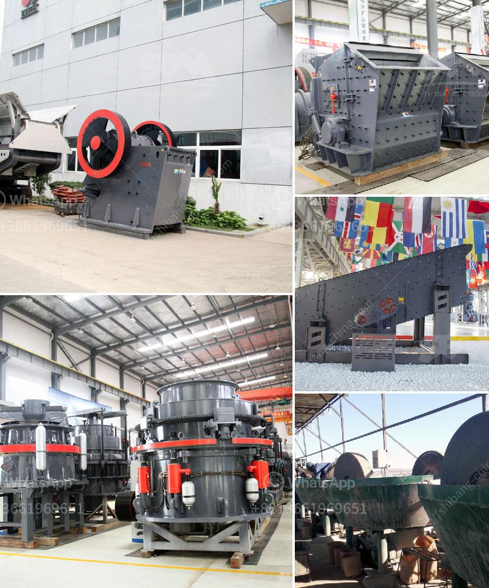

<h3>used complete tantalum processing plant for sale</h3>
Tantalum is a valuable and rare metal that is used in various industries due to its strong resistance to corrosion and high melting point. The demand for tantalum has been increasing over the years, making it a highly sought-after metal in the global market. 

If you are looking to venture into the tantalum processing business or expand your existing operations, purchasing a used complete tantalum processing plant can be a cost-effective solution. These plants are designed to extract tantalum from its ores and convert it into usable forms for various applications.

A used complete tantalum processing plant typically consists of several components, including crushers, screens, magnetic separators, and centrifugal concentrators. These machines work together to extract tantalum from the raw ores, separate impurities, and produce high-quality tantalum concentrate.

One advantage of purchasing a used complete tantalum processing plant is that it saves you time and money. Instead of building a new plant from scratch, you can acquire an existing one and start your operations right away. This can significantly reduce your upfront investment and allow you to generate revenue faster.

Furthermore, used complete tantalum processing plants are often sold at a lower price compared to new ones. This presents an opportunity for cost savings, especially if you are on a tight budget or want to allocate funds for other aspects of your business.

When considering purchasing a used complete tantalum processing plant, it is crucial to inspect the equipment thoroughly. Check for any signs of wear and tear, ensure that all the components are functioning properly, and assess the overall condition of the plant.

It is also recommended to consult with experts in the tantalum processing industry or experienced suppliers who can guide you through the buying process. They can provide valuable advice on selecting the right plant for your specific requirements and assist with any technical aspects or installation procedures.

In conclusion, buying a used complete tantalum processing plant can be a viable option for businesses looking to capitalize on the growing demand for tantalum. It offers numerous advantages such as cost savings, quicker start-up time, and the ability to generate revenue sooner. However, careful inspection and consultation with experts are necessary to ensure a successful purchase and seamless integration into your operations.
<h3>Contact us</h3><ul><li><strong>Whatsapp:&nbsp;<a href="https://wa.me/8613661969651">+8613661969651</a></strong></li><li><a href="https://swt.shibang-china.com/?git&amp;zhl&amp;used complete tantalum processing plant for sale"><strong>Online Service(chat now)</strong></a></li></ul><h3>Related</h3><ul><li><a href='crusher machines for granite in nigeria.md'>crusher machines for granite in nigeria</a></li><li><a href='product curve jaw crusher.md'>product curve jaw crusher</a></li><li><a href='quote for stone crusher.md'>quote for stone crusher</a></li><li><a href='materials hammer mill.md'>materials hammer mill</a></li><li><a href='hammer mill mesin impor china.md'>hammer mill mesin impor china</a></li></ul>