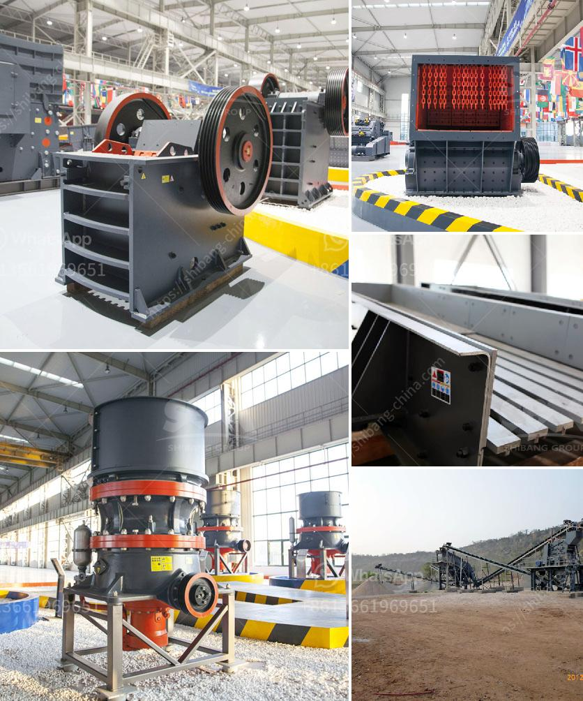

<h3>used concrete crushers uk</h3>
Construction waste management is becoming an increasingly pressing issue across the globe. As urbanization continues to grow, so does the volume of waste generated from construction and demolition activities. In the United Kingdom, the need for sustainable solutions to tackle this problem has become more apparent than ever.

Used concrete crushers are one such sustainable solution that can assist in the efficient management and disposal of construction waste. These machines are specifically designed to break down old concrete, brick, and other building materials into smaller, more manageable pieces.

There are several reasons why used concrete crushers are gaining popularity in the UK. Firstly, these crushers have a significant environmental impact. By recycling concrete waste, fewer natural resources are needed for new construction projects. This not only helps to preserve our environment but also reduces energy consumption and carbon emissions associated with manufacturing new concrete.

Secondly, using used concrete crushers can save significant costs for construction companies and contractors. Instead of paying for the disposal of construction waste, which can be expensive, these machines allow them to recycle and reuse materials on-site, cutting down transportation and landfill expenses. The crushed concrete can also be used as a base or filler material in new construction projects, further reducing the need for additional resource extraction.

In addition to their economic and environmental benefits, used concrete crushers also offer practical advantages. These crushers are highly versatile and can be adjusted to produce different sizes of crushed materials. This flexibility makes them suitable for a wide variety of applications, from road construction and landscaping to the production of recycled aggregates for concrete production.

Furthermore, the operation of used concrete crushers requires minimal manpower. They can be easily operated by a single person, saving labor costs and boosting productivity on construction sites. Additionally, the compact size and mobility of these machines make them ideal for working in tight spaces or urban environments.

When seeking used concrete crushers in the UK, it is essential to choose a reputable supplier. Look for companies with a proven track record and positive customer reviews. This will ensure that you receive a reliable machine that meets your specific needs and performs efficiently.

It is also important to consider the maintenance and after-sales support provided by the supplier. Regular maintenance is crucial for the longevity and performance of the crusher, so it is necessary to understand the warranty terms and availability of spare parts.

In conclusion, used concrete crushers can play an essential role in sustainable construction waste management in the UK. Their ability to recycle and reuse old materials not only benefits the environment but also provides a cost-effective solution for construction companies. By choosing the right supplier and maintaining the crusher properly, businesses can maximize the benefits of these machines while contributing to a greener and more sustainable future.
<h3>Contact us</h3><ul><li><strong>Whatsapp:&nbsp;<a href="https://wa.me/8613661969651">+8613661969651</a></strong></li><li><a href="https://swt.shibang-china.com/?git&amp;zhl&amp;used concrete crushers uk"><strong>Online Service(chat now)</strong></a></li></ul><h3>Related</h3><ul><li><a href='cost of lime stone crusher plant.md'>cost of lime stone crusher plant</a></li><li><a href='cost of a hammer mill.md'>cost of a hammer mill</a></li><li><a href='gold processing mecury sales gauteng.md'>gold processing mecury sales gauteng</a></li><li><a href='mobile copper concentrate machine.md'>mobile copper concentrate machine</a></li><li><a href='how to remove gold dust from sand.md'>how to remove gold dust from sand</a></li></ul>