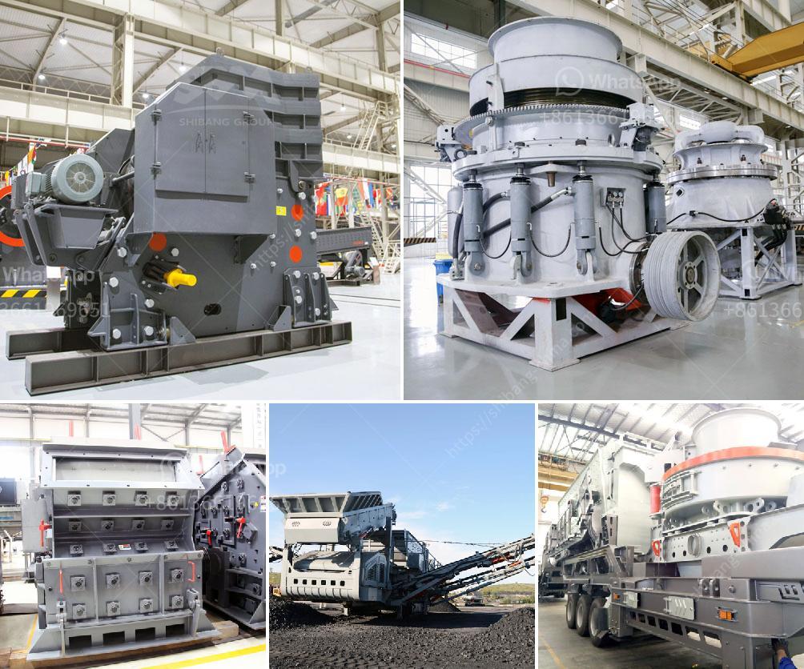

<h3>used cone crushers for sale 50 ton per hour</h3>
Cone crushers are useful tools for crushing rocks and ore in various industrial sectors. They are available in different sizes and capacities ranging from 0.1 ton/hr to 50 ton/hr. In this article, we will discuss the used cone crushers specifically used for sale in the 50-ton per hour capacity range.

Finding the right crusher is vital for any crushing operation. Whether you are processing materials for construction, mining, or any other industry, an efficient and reliable crusher can make a significant difference in your productivity and profitability. When it comes to cone crushers, they are known for their versatility and cost-effectiveness.

The cone crusher crushes the material by squeezing it between a concave-shaped mantle and a concave bowl liner. As the material enters the crusher, it is gradually compressed and crushed into smaller pieces as it moves towards the discharge opening. The hydraulic system in the cone crusher ensures precise control over the crushing process, allowing for a consistent product size and shape.

Used cone crushers are an excellent option if you are looking for an affordable alternative to purchasing a new crusher. They offer the same functionality and reliable performance as new crushers but at a fraction of the cost. In addition, used cone crushers are readily available, making them a convenient choice for businesses in urgent need of a crushing solution.

One of the key factors to consider when buying a used cone crusher is its capacity. Cone crushers are available in various capacities, typically ranging from 0.1 ton/hr to 50 ton/hr. The capacity of the cone crusher determines the maximum size of the material it can handle. A higher capacity cone crusher is capable of processing larger volumes of ore or rocks within a shorter period, thus increasing productivity.

The 50-ton per hour cone crushers are commonly used for medium to large scale crushing operations. The They are ideal for producing aggregates for construction and infrastructure projects. With a capacity of 50 tons per hour, used cone crushers in this size range are perfect for medium-sized operations.

When looking for used cone crushers for sale in the 50-ton per hour range, it is essential to consider the equipment's condition. A well-maintained, gently used cone crusher can still provide excellent performance and efficiency. However, it is essential to inspect the crusher thoroughly, checking for any signs of wear or damage.

In conclusion, used cone crushers are an excellent option for businesses looking to improve their crushing operations without investing in new equipment. With capacities ranging from 0.1 ton/hr to 50 ton/hr, cone crushers are ideal for various industries. When purchasing used cone crushers, it is crucial to consider the equipment's capacity, condition, and compatibility with your specific requirements. By doing so, you can find a cost-effective solution that meets your crushing needs.
<h3>Contact us</h3><ul><li><strong>Whatsapp:&nbsp;<a href="https://wa.me/8613661969651">+8613661969651</a></strong></li><li><a href="https://swt.shibang-china.com/?git&amp;zhl&amp;used cone crushers for sale 50 ton per hour"><strong>Online Service(chat now)</strong></a></li></ul><h3>Related</h3><ul><li><a href='250tph comprehensive portable crushing plant.md'>250tph comprehensive portable crushing plant</a></li><li><a href='used mobile jaw crusher for sale uk.md'>used mobile jaw crusher for sale uk</a></li><li><a href='jaw crushers for sale south africa.md'>jaw crushers for sale south africa</a></li><li><a href='dust control for crushing plants.md'>dust control for crushing plants</a></li><li><a href='best crushers for manufactured sand.md'>best crushers for manufactured sand</a></li></ul>