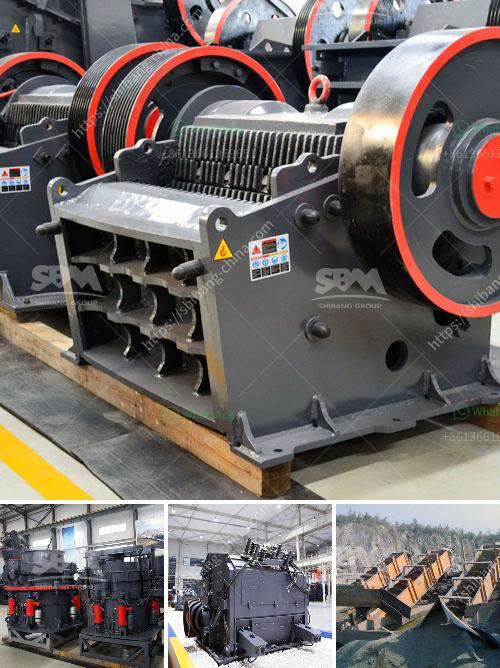

<h3>used crusher in tanzania</h3>
Tanzania, located in East Africa, is known for its rich mineral resources. The mining industry plays a significant role in the country's economy, contributing to both employment and foreign exchange earnings. Crushers, machines designed to break rocks into smaller sizes, are vital equipment in the mining sector. However, not every mining company can afford to purchase new crushers. Consequently, the market for used crushers has been thriving in Tanzania, providing an affordable solution for many businesses.

Used crushers offer significant cost savings for mining companies in Tanzania. New crushers are often expensive and may require substantial financing that not every mining company can secure. By opting for reasonably priced used crushers, companies can allocate their financial resources more efficiently, enabling them to invest in other critical areas of their operations, such as exploration, infrastructure development, or workforce training.

Moreover, used crushers are readily available in the market, ensuring a shorter procurement cycle. This expedited process is crucial for mining companies aiming to quickly ramp up their operations or replace outdated equipment. Rather than waiting for delivery times associated with new crushers, companies can immediately acquire used ones and boost their production capabilities.

The global mining industry is increasingly becoming more environmentally conscious, with many companies striving to adopt sustainable practices. Acquiring used crushers aligns with this sustainable approach, as it contributes to reducing the carbon footprint associated with manufacturing new machinery. By reusing equipment, the demand for new manufacturing is reduced, resulting in lower energy consumption and a reduced burden on natural resources.

While purchasing used crushers, mining companies in Tanzania should ensure that they thoroughly inspect the equipment for any damage or wear to maximize its operational lifespan. Engaging experienced engineers to evaluate the crushers' overall condition helps verify the quality and suitability of the equipment for their specific needs. Additionally, it is essential to review the maintenance records and service history of the crushers before making a purchase.

The demand for used crushers in the Tanzanian mining sector remains strong, driven by the need for cost-effective solutions among mining companies. The affordability, availability, and sustainability aspects associated with used crushers make them a compelling option for businesses looking to optimize their budget allocation and streamline operations. However, careful inspection and quality assurance processes are necessary to ensure the acquired crushers meet the requirements of the mining operations and offer a reliable and efficient solution.

In conclusion, the thriving market for used crushers in Tanzania not only fosters economic growth and sustainability for mining companies but also promotes prudent resource management, acknowledging the environmental challenges faced by the industry. Embracing the use of used crushers enables businesses to strike a balance between investment costs and operational efficiency, ultimately contributing to the continued prosperity of Tanzania's mining sector.
<h3>Contact us</h3><ul><li><strong>Whatsapp:&nbsp;<a href="https://wa.me/8613661969651">+8613661969651</a></strong></li><li><a href="https://swt.shibang-china.com/?git&amp;zhl&amp;used crusher in tanzania"><strong>Online Service(chat now)</strong></a></li></ul><h3>Related</h3><ul><li><a href='crusher machines for granite in nigeria.md'>crusher machines for granite in nigeria</a></li><li><a href='limestone ball mill machine.md'>limestone ball mill machine</a></li><li><a href='maize ball mills in south africa.md'>maize ball mills in south africa</a></li><li><a href='jaw rock crusher for sale.md'>jaw rock crusher for sale</a></li><li><a href='uk quarry machinery manufacturers.md'>uk quarry machinery manufacturers</a></li></ul>