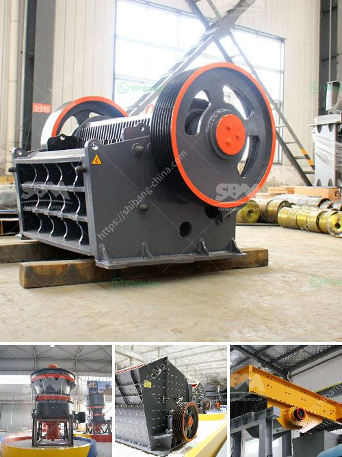

<h3>used crusher plant in uae</h3>
Crushers are the main component of any crusher plant. They are mainly used for crushing stones or rocks into smaller sizes for further processing. Their role is crucial in the production of aggregates and other materials used in construction, infrastructure, and various industries.

The UAE is a rapidly developing country with a burgeoning construction industry. As a result, the demand for aggregates, rocks, and other materials for construction purposes is ever-increasing. This is where crusher plants come into the picture, providing an efficient and reliable solution for crushing.

Used crusher plants in the UAE offer unique advantages compared to commonly used methods of crushing. These machines produce higher quality and more consistent grained materials, which is vital for creating high-quality concrete or asphalt. With the advancements in technology, crushers have become more efficient and easier to use, reducing the time and effort required for crushing operations.

One major advantage of using crusher plants in the UAE is their flexibility, allowing operations to be easily adjusted to suit different project requirements. Whether a project needs graded aggregates, dust, or specific sizes of stones, crusher plants can be easily configured to produce the desired products. This flexibility ensures that construction projects can be completed efficiently, saving time and resources.

Furthermore, used crusher plants in the UAE are a cost-effective option for businesses looking to expand their operations and maximize their profitability. By investing in a used crusher plant, companies can save significant amounts of money compared to purchasing new equipment. Additionally, the resale value of these plants remains relatively high, providing a viable exit strategy for businesses in the future.

In recent years, the UAE government has placed greater emphasis on sustainable development and environmental conservation. Used crusher plants contribute to these efforts by reducing the need for new machinery production, which requires the extraction of raw materials and energy consumption. By recycling and reusing materials through crusher plants, companies can reduce their environmental footprint and contribute to a more sustainable future.

When considering the purchase of a used crusher plant in the UAE, it is important to choose a reputable supplier that offers reliable equipment. The supplier should have a proven track record in the industry and provide comprehensive after-sales service and support. This ensures that the crusher plant performs optimally and any operational issues are promptly addressed.

In conclusion, used crusher plants in the UAE offer an efficient and reliable solution for crushing stones and rocks into smaller sizes for further processing. These plants contribute to the growth of the construction industry and provide a cost-effective option for businesses. Additionally, using crusher plants helps in promoting sustainable development and environmental conservation. By investing in a used crusher plant, businesses can enhance their operations while reducing their environmental footprint.
<h3>Contact us</h3><ul><li><strong>Whatsapp:&nbsp;<a href="https://wa.me/8613661969651">+8613661969651</a></strong></li><li><a href="https://swt.shibang-china.com/?git&amp;zhl&amp;used crusher plant in uae"><strong>Online Service(chat now)</strong></a></li></ul><h3>Related</h3><ul><li><a href='trackmounted equipment.md'>track-mounted equipment</a></li><li><a href='price of zenithcrusher plant.md'>price of zenithcrusher plant</a></li><li><a href='limestone tons hour machinery.md'>limestone tons hour machinery</a></li><li><a href='india herzog pulverizer hp m 100 p venta.md'>india herzog pulverizer hp m 100 p venta</a></li><li><a href='price pe 600 and 900 stone crusher.md'>price pe 600 and 900 stone crusher</a></li></ul>