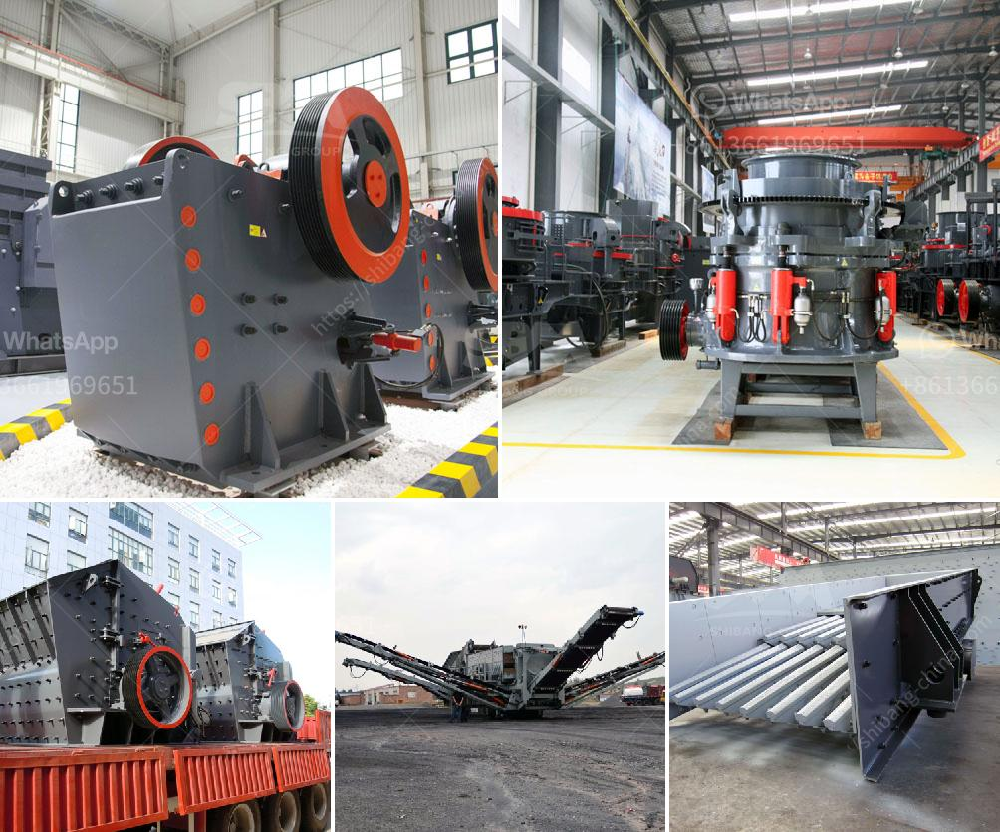

<h3>used crushers for sale in usa</h3>
When it comes to crushing materials, recycling, or quarrying, efficiency is key. And with the increasing demand for aggregate materials, finding an affordable solution is more crucial than ever. This is where used crushers for sale in the USA come into play. With a wide range of options available, these pre-owned machines offer a cost-effective alternative to purchasing new equipment.

One of the key advantages of opting for used crushers is the substantial savings you can achieve. Pre-owned crushers are typically priced at a fraction of the cost of new models, allowing you to stretch your budget further without compromising on quality. This is particularly beneficial for small to medium-sized businesses or those looking to expand their operations without breaking the bank.

Another advantage of investing in used crushers is the immediate availability. Unlike waiting times associated with new machinery, you can begin using your pre-owned crusher right away. This means you can stay on track with your projects, increase productivity, and minimize downtime.

Additionally, used crushers often come with warranties, guaranteeing their functionality and performance. Reputable sellers thoroughly inspect and service these machines, ensuring they are in optimal working condition. This peace of mind allows you to focus on your operations without having to worry about unexpected breakdowns or costly repairs.

Used crushers come in various models and types, catering to different needs and requirements. From jaw crushers and impact crushers to cone crushers and screening plants, there is a used crusher solution for every application. By carefully considering your specific needs, you can find the best fit for your operation.

In conclusion, used crushers for sale in the USA offer an affordable and reliable solution for crushing needs. With substantial savings, immediate availability, and warranty options, these pre-owned machines provide a cost-effective alternative to new equipment. By choosing the right model and type, you can enhance productivity, streamline operations, and satisfy your crushing requirements without overspending.
<h3>Contact us</h3><ul><li><strong>Whatsapp:&nbsp;<a href="https://wa.me/8613661969651">+8613661969651</a></strong></li><li><a href="https://swt.shibang-china.com/?git&amp;zhl&amp;used crushers for sale in usa"><strong>Online Service(chat now)</strong></a></li></ul><h3>Related</h3><ul><li><a href='calcium carbonate crusher.md'>calcium carbonate crusher</a></li><li><a href='iron ore beneficiation process in mexico.md'>iron ore beneficiation process in mexico</a></li><li><a href='lime production line price.md'>lime production line price</a></li><li><a href='iron crusher manufacturer.md'>iron crusher manufacturer</a></li><li><a href='specification of a ball mill.md'>specification of a ball mill</a></li></ul>