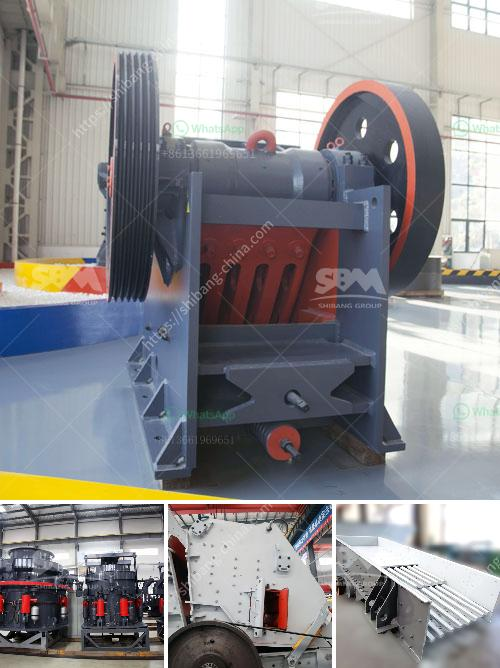

<h3>used crushing quarry plant in south africa stone</h3>
The mining industry in South Africa is one of the largest contributors to the country's GDP. As such, it is essential to ensure that the industry has access to reliable and efficient equipment to meet its crushing needs. This is where used crushing quarry plants come into play.

A used crushing quarry plant in South Africa allows end-users to enjoy the benefits of owning a well-built and durable machine without having to pay the hefty price tags of brand new equipment. Because these machines have been previously used, they undergo thorough inspections and refurbishments to ensure they are in optimal working condition.

One of the key benefits of investing in a used crushing quarry plant is the cost-saving factor. By opting for a pre-owned machine, businesses can significantly reduce their capital expenditure while still acquiring a high-performing crushing plant. This cost-saving can then be reinvested into other areas of the operation, such as hiring skilled personnel or improving infrastructure.

Another advantage of purchasing a used crushing quarry plant is the reduced lead time. With new machines, there is often a waiting period for manufacturing and delivery. In contrast, pre-owned quarry plants are readily available, allowing businesses to immediately address their crushing needs and avoid any downtime.

Additionally, acquiring a used crushing quarry plant is a more sustainable option. By reusing and refurbishing existing equipment, the mining industry can contribute to minimizing waste and reducing the carbon footprint associated with manufacturing new machinery.

As with any used equipment, it is essential to research and select a reputable supplier when purchasing a used crushing quarry plant. Ensuring the supplier has a proven track record, offers warranties, and provides after-sales support is crucial. This way, businesses can have peace of mind knowing that they are investing in a reliable and efficient machine.

In conclusion, a used crushing quarry plant in South Africa is a cost-effective and sustainable solution for businesses in the mining industry. By acquiring a pre-owned machine, companies can save on costs, reduce lead times, and contribute to a more sustainable future.
<h3>Contact us</h3><ul><li><strong>Whatsapp:&nbsp;<a href="https://wa.me/8613661969651">+8613661969651</a></strong></li><li><a href="https://swt.shibang-china.com/?git&amp;zhl&amp;used crushing quarry plant in south africa stone"><strong>Online Service(chat now)</strong></a></li></ul><h3>Related</h3><ul><li><a href='small portable rock crushers for sale africa.md'>small portable rock crushers for sale africa</a></li><li><a href='processing on barite crushing.md'>processing on barite crushing</a></li><li><a href='slag grinding ball mill.md'>slag grinding ball mill</a></li><li><a href='iron crushing equipment price.md'>iron crushing equipment price</a></li><li><a href='brand new cone crusher for sale india.md'>brand new cone crusher for sale india</a></li></ul>