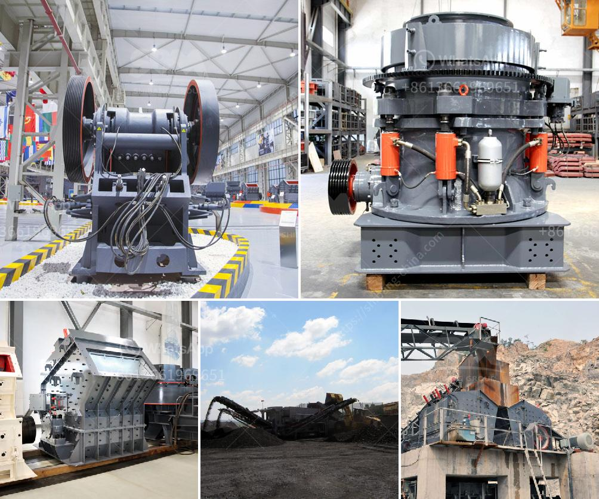

<h3>used gold crushing for sale in uae</h3>
Gold is widely considered a valuable commodity, and its demand has been consistently high in various industries worldwide. The United Arab Emirates (UAE) has long been one of the leading gold trading centers in the Middle East, attracting investors and buyers from all over the world. With its strong economy and robust infrastructure, the UAE offers excellent opportunities for those looking to purchase used gold crushing equipment.

Gold crushing refers to the process of extracting gold from gold ore. A variety of techniques can be used to extract gold, including crushing and grinding, gravity separation, flotation, and cyanidation. Various types of crushers can be used for this purpose, including jaw crushers, cone crushers, and impact crushers.

The UAE has a thriving gold mining industry, with gold mines operating in several regions of the country. Mining activities in the UAE often involve the extraction of gold from secondary sources, such as gold jewelry and scrap gold, as well as primary sources, such as gold ore. The gold extracted from primary sources is then refined and sold as gold bars or gold coins.

For those interested in purchasing used gold crushing equipment in the UAE, there are several options available. Many gold mines in the UAE frequently update their equipment and machinery, leading to a surplus of used gold crushing equipment for sale. If you are in the market for a used crusher, there are plenty of options to choose from, ranging from jaw crushers to impact crushers.

When purchasing used gold crushing equipment, it is essential to consider the condition of the equipment and its performance. Inspecting the equipment thoroughly before finalizing the purchase is highly recommended. It is crucial to check for any signs of wear and tear, as well as any required repairs or replacements. Consulting with an expert or seeking the advice of a knowledgeable technician can also help ensure that you make an informed decision.

In addition to considering the condition of the equipment, it is essential to consider the price and value for money. Used gold crushing equipment in the UAE is typically sold at a fraction of its original cost, making it an attractive option for buyers. However, it is still essential to compare prices, research market trends, and negotiate a fair deal. Conducting thorough research and understanding the current market value of used gold crushing equipment can help you make a wise investment.

In conclusion, the UAE offers excellent opportunities for those interested in purchasing used gold crushing equipment. With a thriving gold mining industry and a surplus of used equipment, buyers can find high-quality crushers at competitive prices. However, it is crucial to consider the condition, performance, and price of the equipment before finalizing a purchase. By conducting thorough research and seeking expert advice, buyers can make an informed decision and secure a valuable investment in used gold crushing equipment.
<h3>Contact us</h3><ul><li><strong>Whatsapp:&nbsp;<a href="https://wa.me/8613661969651">+8613661969651</a></strong></li><li><a href="https://swt.shibang-china.com/?git&amp;zhl&amp;used gold crushing for sale in uae"><strong>Online Service(chat now)</strong></a></li></ul><h3>Related</h3><ul><li><a href='list of equipments needed to start gold mining.md'>list of equipments needed to start gold mining</a></li><li><a href='complete crusher for sale.md'>complete crusher for sale</a></li><li><a href='crawler type mobile crusher plant.md'>crawler type mobile crusher plant</a></li><li><a href='alluvial gold mining machines.md'>alluvial gold mining machines</a></li><li><a href='mtm trapezium grinder mill.md'>mtm trapezium grinder mill</a></li></ul>