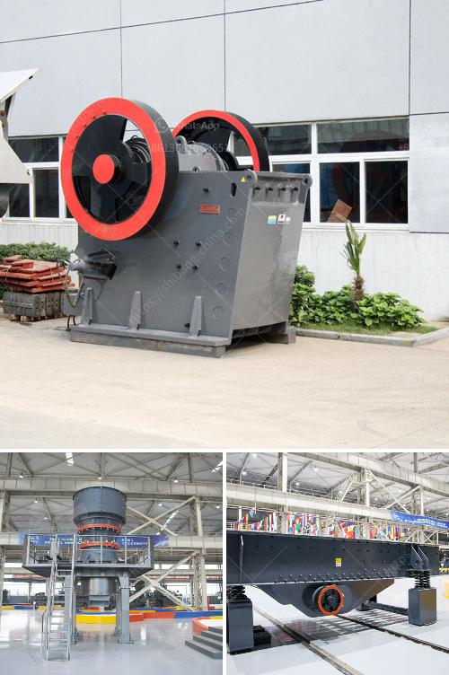

<h3>used gold mill for sale south africa</h3>
South Africa has a rich gold mining history, making it one of the leading producers of this precious metal in the world. As the demand for gold continues to rise, many mining companies in the country are looking for cost-effective solutions to process their gold ore. One option that has gained popularity in recent years is purchasing a used gold mill. In this article, we will explore the benefits of buying used gold mills in South Africa and provide valuable insights for potential buyers.

Investing in a brand new gold mill can be a significant expense, especially for smaller mining operations or new entrants in the industry. By opting for a used gold mill, companies can significantly reduce their initial capital expenditure. This enables them to allocate their resources more efficiently, such as investing in additional exploration or expanding their operations.

One common misconception about buying used equipment is that it may compromise the product's quality. However, many used gold mills in South Africa are in excellent condition, thanks to the durability and robustness of these machines. It is essential to source reliable used gold mills from reputable sellers who can provide detailed information about the mill's maintenance history and any repairs that have been conducted.

When purchasing a used gold mill, buyers have the opportunity to thoroughly test the equipment before finalizing the purchase. This is an advantage over purchasing a new mill, where potential functional issues may not become apparent until it is operational. Testing a used mill allows for a comprehensive assessment of its operational efficiency, including its processing capacity, power consumption, and overall performance.

Another significant advantage of purchasing a used gold mill is the reduced delivery time compared to ordering a new one. As new mills require time for manufacturing and transportation, purchasing a used mill can enable companies to start processing their gold ore sooner. This factor becomes even more crucial when there is a high demand for gold or when prices are favorable.

Reputable sellers of used gold mills often provide comprehensive after-sales support, including technical assistance, spare parts, and maintenance services. This creates peace of mind for buyers, knowing that assistance is available if any issues arise. By choosing a trusted seller, companies can benefit from their expertise and experience in the gold mining industry.

In conclusion, purchasing a used gold mill in South Africa offers several benefits for mining companies looking to process their gold ore efficiently. The cost-effectiveness, quality assurance, operational testing, reduced delivery time, and after-sales support make this an attractive option. However, it is crucial to conduct thorough due diligence, verify the mill's condition, and choose a reputable seller to ensure a successful purchase. Mining companies that opt for used gold mills align themselves with cost-efficient and sustainable operations, enabling them to thrive in South Africa's vibrant gold mining industry.
<h3>Contact us</h3><ul><li><strong>Whatsapp:&nbsp;<a href="https://wa.me/8613661969651">+8613661969651</a></strong></li><li><a href="https://swt.shibang-china.com/?git&amp;zhl&amp;used gold mill for sale south africa"><strong>Online Service(chat now)</strong></a></li></ul><h3>Related</h3><ul><li><a href='caco3 carbonate calcium line production.md'>caco3 carbonate calcium line production</a></li><li><a href='bentonite clay crusher for sale.md'>bentonite clay crusher for sale</a></li><li><a href='part of hammer mill.md'>part of hammer mill</a></li><li><a href='quarry machines for sale.md'>quarry machines for sale</a></li><li><a href='list of quarry crusher company in the philippines.md'>list of quarry crusher company in the philippines</a></li></ul>