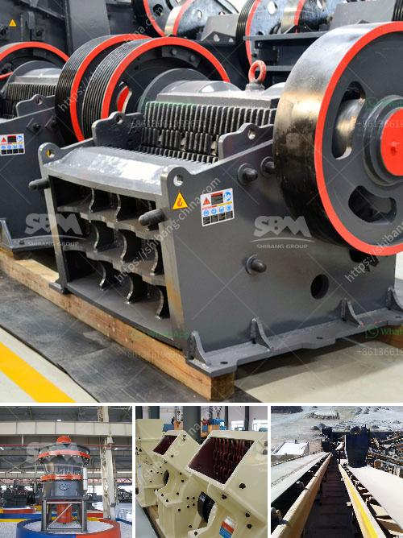

<h3>used gold mills for sale</h3>
Gold has always been highly regarded as a precious metal, and throughout history, it has played a significant role in the economy. Today, gold continues to be a sought-after investment and holds a special place in many portfolios. With its stability and potential for long-term growth, it is no surprise that many individuals are interested in acquiring gold. Those looking to invest in gold may want to consider purchasing used gold mills, as they offer an affordable and practical way to enter the market.

Gold mills, also known as stamp mills, are an essential part of the gold mining process. They are used to crush ore and extract precious metals such as gold. These mills were commonly used during the gold rush in the 19th century and continue to be widely used in mining operations today. While new gold mills can be expensive, used gold mills are a cost-effective option for those looking to start or expand their gold mining endeavors.

One of the main advantages of purchasing used gold mills is the significant cost savings. New mills can be prohibitively expensive, especially for smaller-scale operations or individual investors. However, used mills can be found at a fraction of the cost, making them accessible to a broader range of investors. This affordability also allows investors to allocate more of their budget to other crucial aspects of a gold mining operation, such as exploration, equipment, or labor.

Another advantage of purchasing used gold mills is the potential for immediate production. Since these mills have already been used in gold mining operations, they are likely to be fully functional and ready for operation. This eliminates the need for lengthy lead times associated with manufacturing new mills. With a used mill in hand, investors can begin production relatively quickly, maximizing their return on investment.

Furthermore, purchasing used gold mills provides eco-friendly benefits. By recycling and reusing existing mills, investors contribute to reducing environmental impact and promote sustainable mining practices. This aligns with the growing global focus on environmental responsibility, which is increasingly important to both investors and consumers alike.

To ensure a successful purchase, it is essential to conduct thorough research before investing in used gold mills. Buyers should inspect the mills for any signs of wear and tear and inquire about their previous usage. Verifying the mill's performance and overall condition is critical to avoid any unexpected expenses or downtime in the future. It is also advisable to consult with an experienced mining professional who can offer guidance and assist in the selection process.

In summary, used gold mills offer investors an excellent opportunity to enter the gold mining market without the high costs associated with purchasing new mills. These mills provide significant cost savings, immediate production potential, and contribute to environmentally sustainable practices. However, it is crucial to conduct proper due diligence and seek expert advice before making any purchase. By doing so, investors can make an informed decision and maximize their chances of success in the gold mining industry.
<h3>Contact us</h3><ul><li><strong>Whatsapp:&nbsp;<a href="https://wa.me/8613661969651">+8613661969651</a></strong></li><li><a href="https://swt.shibang-china.com/?git&amp;zhl&amp;used gold mills for sale"><strong>Online Service(chat now)</strong></a></li></ul><h3>Related</h3><ul><li><a href='new crushing machines in oman.md'>new crushing machines in oman</a></li><li><a href='zinc ash crusher machine required.md'>zinc ash crusher machine required</a></li><li><a href='cost of setting up cement plant per mtpa.md'>cost of setting up cement plant per mtpa</a></li><li><a href='iron crusher in mexico.md'>iron crusher in mexico</a></li><li><a href='production process of gypsum.md'>production process of gypsum</a></li></ul>