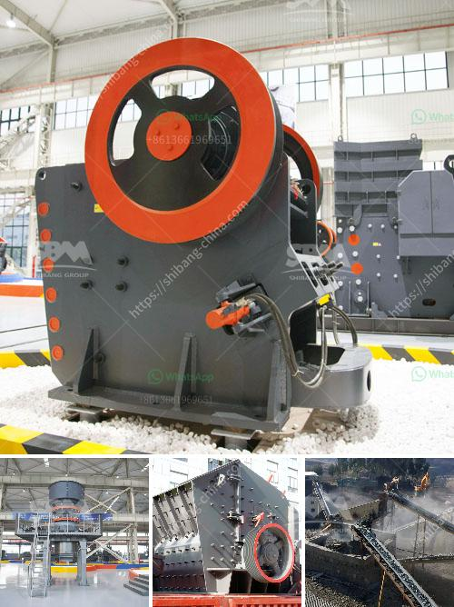

<h3>used gypsum crusher machine for sale in pakistan</h3>
Gypsum is a widely used in the cement industry as a retarding agent, and processing gypsum crushers are generally used for crushing gypsum. However, due to gypsum's hardness and viscous nature, it is difficult to process the gypsum manually. The gypsum crusher machine has many advantages and characteristics which can not be replaced by other crushing equipment.

In Pakistan, gypsum has been widely used in construction and manufacturing industries, especially in cement, fertilizer, and gypsum board industries. The gypsum processing industry is thriving in Pakistan and has been in continuous growth since independence.

To process gypsum effectively, various types of gypsum crushing plants are used. The jaw crusher, impact crusher, cone crusher, and mobile crusher are commonly used in the gypsum crushing plant. Gypsum crushing equipment is widely used in crushing all kinds of ores, cement, refractories, bauxite, clinker, carborundum, glass raw materials, mechanism building sand, stone, and various metallurgical slags.

In addition, our company's gypsum crusher machine is designed specifically for the harsh conditions of the mining industry. The large feed opening and force-feeding action from the inward and downward eccentric movement of the swing jaw ensure high production rates, long service life, and low operating costs. Our gypsum crusher machine is highly reliable, safe, and easy to maintain.

The gypsum crusher machine for sale in Pakistan is suitable for crushing materials with a particle size more than 3mm, and the final product particle size depends on the gap between the hammer head and the liner plate at the bottom. The gypsum crusher machine offers a high reduction ratio as well, as the ability to conduct both primary and secondary crushing.

Our gypsum crusher machines are commonly used for the crushing of gypsum ore materials, such as slab, limestone, clay, coal gangue, minerals, and other medium-hard and brittle materials. The maximum compressive strength of the crushed material can reach 320 MPa. Our gypsum crusher machine has many advantages:

- Simple structure: The cavity is deep and no dead zone, which improves the feeding capacity and output.

- Uniform particle size: The gap between the counterattack plate and the hammer can be easily adjusted to effectively control the particle size.

- Wide range of application: The gypsum crusher machine is suitable for crushing medium and high hardness materials.

- Reliable performance: It adopts high-quality high-intensity wear-resistant materials, which ensure the stability and reliability of the whole machine operation.

In conclusion, the gypsum crusher machine is an indispensable equipment in Pakistan's gypsum crushing production line. It not only provides high-quality gypsum raw materials for gypsum board manufacturing but also effectively reduces the subsequent production costs. As a professional gypsum crusher manufacturer, we have a full range of gypsum crushing machines for sale. If you are interested, please feel free to contact us for more information.
<h3>Contact us</h3><ul><li><strong>Whatsapp:&nbsp;<a href="https://wa.me/8613661969651">+8613661969651</a></strong></li><li><a href="https://swt.shibang-china.com/?git&amp;zhl&amp;used gypsum crusher machine for sale in pakistan"><strong>Online Service(chat now)</strong></a></li></ul><h3>Related</h3><ul><li><a href='dry grinding mill.md'>dry grinding mill</a></li><li><a href='calculation of crushing plant.md'>calculation of crushing plant</a></li><li><a href='mobile gold processing plant 1 2 tph.md'>mobile gold processing plant 1 2 tph</a></li><li><a href='ballast crushing machine prices in kenya.md'>ballast crushing machine prices in kenya</a></li><li><a href='basalt processing machine.md'>basalt processing machine</a></li></ul>