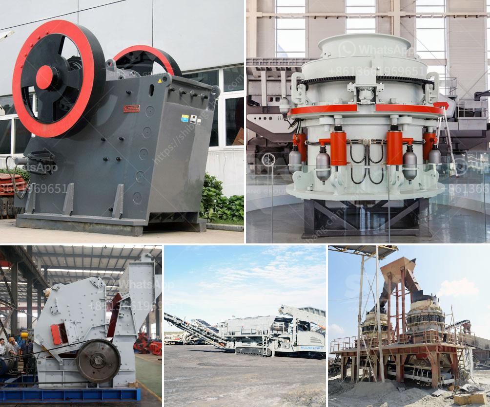

<h3>used hammer mill crusher</h3>
A hammer mill crusher is a machine that utilizes a high-speed rotating hammering process to reduce materials into smaller pieces. The hammer mill crusher used in the industries such as cement, coal separation, electricity generation, building materials, and compound fertilizer, etc. And the hammer crusher not only can be used for the crushing plant, sand making plant, but also can replace the cone crusher in the mineral processing plant.

Hammer mill crushers have the advantages of simple structure, high crushing ratio, low energy consumption, and uniform particle size. Moreover, this kind of crushing equipment is suitable for medium and fine crushing of medium hardness and brittle materials. It is widely used in mining, cement, coal, metallurgy, building materials, highway, and other industries.

Used hammer mill crushers are equipped with adjustable crushing plates, which improve crushing efficiency and prolong hammer mill crusher lifespan. The hammer mill crusher is ideal for crushing minerals of various types, and its application range is wide, ranging from gypsum, coal, limestone, shale, and gypsum to crushing and grinding of screened clay.

Moreover, used hammer mill crushers are used for crushing rocks and other materials such as glass, PVC materials, aluminum cans, and others. In addition, the hammer mill crusher can be not only applied in the crushing production line and sand making production line but also used for replacing cone crusher in the ore beneficiation line.

In conclusion, the used hammer mill crusher is a good choice to crush medium-hardness and brittle materials, and it is widely used in various industries. With the continuous development of mining machinery, hammer crusher has become more advanced and more convenient to use. It is believed that the used hammer mill crusher will bring benefits to customers and contribute to the development of the industry.
<h3>Contact us</h3><ul><li><strong>Whatsapp:&nbsp;<a href="https://wa.me/8613661969651">+8613661969651</a></strong></li><li><a href="https://swt.shibang-china.com/?git&amp;zhl&amp;used hammer mill crusher"><strong>Online Service(chat now)</strong></a></li></ul><h3>Related</h3><ul><li><a href='chinese limestone mining investors.md'>chinese limestone mining investors</a></li><li><a href='copper mining process.md'>copper mining process</a></li><li><a href='vsi crusher manufacturer.md'>vsi crusher manufacturer</a></li><li><a href='hammer mill machine 20hp.md'>hammer mill machine 20hp</a></li><li><a href='typical roll and roll mill.md'>typical roll and roll mill</a></li></ul>