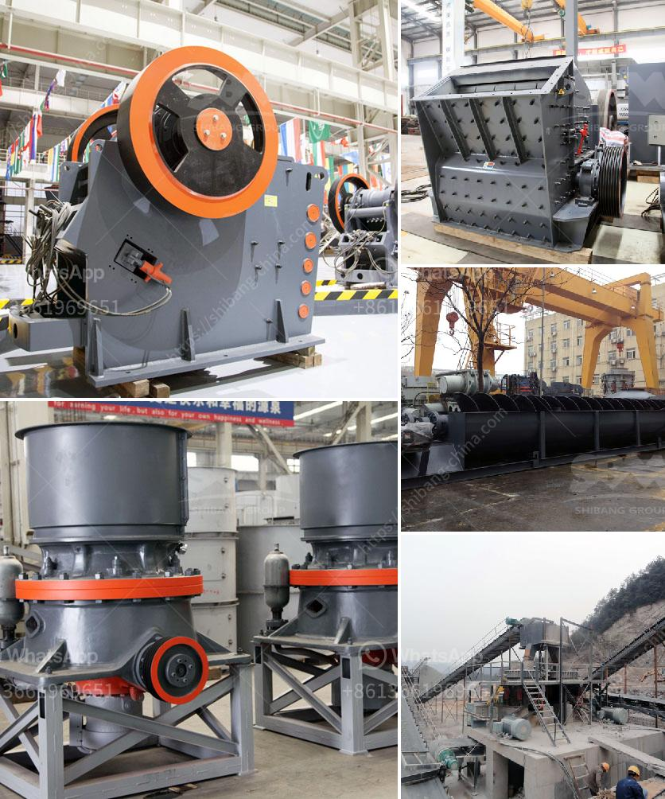

<h3>used hammer mill in india</h3>
India is an agricultural country where farming is the primary occupation for a majority of the population. With farmers trying to optimize their productivity and reduce manual labor, the demand for efficient agricultural equipment is at an all-time high. Amongst these, the used hammer mill has emerged as a viable option for farmers across the country.

A hammer mill is a machine used for shredding or crushing materials into smaller pieces. It is widely used in various agricultural processes like grinding grains, making flour, and preparing animal feed. The machine works on the principle of impact and utilizes a rotating hammer to reduce the size of the materials.

Purchasing a brand-new hammer mill can be a costly affair for small-scale farmers. However, with the availability of used hammer mills in India, farmers can now easily access high-quality equipment at affordable prices. These used machines are sourced from various industries and undergo thorough refurbishment to ensure their functioning and reliability.

One of the primary advantages of opting for a used hammer mill is the substantial cost saving. Farmers can procure these machines at a fraction of the price of a new one, without compromising on the quality and performance. This affordability empowers small and marginal farmers, allowing them to enhance their productivity and profitability.

Furthermore, used hammer mills also contribute to sustainable farming practices. By recycling and reusing these machines, we reduce the environmental impact associated with manufacturing new equipment. This approach aligns with the concept of a circular economy, where resources are efficiently utilized, and waste is minimized.

Various suppliers and dealers in India specialize in selling used hammer mills to cater to the growing demand. They ensure that the equipment is thoroughly inspected and tested before it reaches the hands of the buyers. Additionally, these suppliers also provide after-sales service and spare parts, further enhancing the reliability and longevity of these machines.

In conclusion, the availability of used hammer mills in India has revolutionized the agricultural sector. Farmers now have an affordable alternative that can significantly enhance their productivity and reduce manual labor. Moreover, by opting for used machines, they contribute to a more sustainable and environmentally friendly farming ecosystem.
<h3>Contact us</h3><ul><li><strong>Whatsapp:&nbsp;<a href="https://wa.me/8613661969651">+8613661969651</a></strong></li><li><a href="https://swt.shibang-china.com/?git&amp;zhl&amp;used hammer mill in india"><strong>Online Service(chat now)</strong></a></li></ul><h3>Related</h3><ul><li><a href='pulverizer crusher machine for coal.md'>pulverizer crusher machine for coal</a></li><li><a href='gold mining processing plant in canada.md'>gold mining processing plant in canada</a></li><li><a href='cement grinding plants.md'>cement grinding plants</a></li><li><a href='ball mills zenith china.md'>ball mills zenith china</a></li><li><a href='used 900 cone crusher for sale.md'>used 900 cone crusher for sale</a></li></ul>