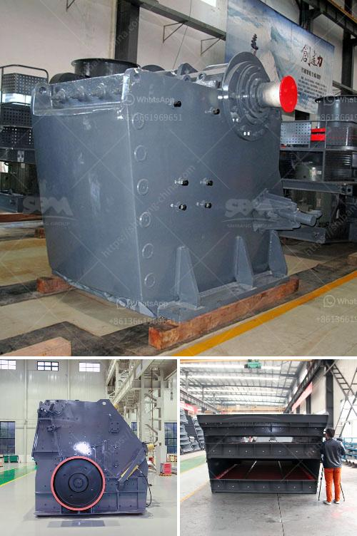

<h3>used hammer mill</h3>
A used hammer mill is a piece of crushing/shredding equipment that breaks down materials into smaller pieces by repeatedly striking them with hammers. These machines have different applications ranging from grinding grains to shredding yard waste, and are typically used in industrial settings. In this article, we will discuss the various aspects of a used hammer mill, including its benefits, limitations, and common uses.

Used hammer mills offer a cost-effective alternative to new models, making them a popular choice for businesses on a budget. These machines are durable and sturdy, capable of handling a wide range of materials and applications. Their versatility makes them an attractive option for a variety of industries, including farming, construction, and biomass processing.

One of the main advantages of a used hammer mill is its ability to process a wide range of materials. From grains and minerals to wood and yard waste, these machines can handle it all. They are commonly used in the agricultural industry to grind crops like corn, wheat, and soybeans into a fine powder for animal feed. Hammer mills are also essential equipment in the recycling and biomass industries, where they are used to shred and reduce materials like wood chips, paper, cardboard, and yard waste.

Used hammer mills are known for their efficiency in reducing the size of materials quickly and effectively. By repeatedly striking the material with rotating hammers, these machines can break down even the toughest materials into smaller fragments. This makes them an ideal choice for processing materials into smaller, more manageable sizes for further processing or disposal.

However, like any piece of equipment, used hammer mills have their limitations. These machines require regular maintenance and servicing to ensure optimal performance. Some models may also have specific requirements in terms of power and infrastructure, making it important to consider these factors before purchasing a used hammer mill.

It is also crucial to consider the condition of the used hammer mill before finalizing a purchase. While many used machines are still in good working condition, some may require repairs or replacement parts. It is essential to thoroughly inspect the machine and consult with the seller to ensure that it meets your specific needs.

When purchasing a used hammer mill, it is recommended to buy from a reputable seller or dealer. They can provide you with accurate information about the machine's history, maintenance records, and any potential issues. It is also advisable to inquire about any available warranty or guarantee that may come with the machine to protect your investment.

In conclusion, a used hammer mill is a versatile piece of equipment that can be a cost-effective solution for various material processing needs. With the ability to handle a wide range of materials, these machines are commonly used in industries like agriculture, recycling, and biomass processing. However, it is essential to consider the machine's maintenance requirements, limitations, and condition before making a purchase. By doing thorough research and working with a reputable seller, you can find a used hammer mill that meets your specific needs and budget.
<h3>Contact us</h3><ul><li><strong>Whatsapp:&nbsp;<a href="https://wa.me/8613661969651">+8613661969651</a></strong></li><li><a href="https://swt.shibang-china.com/?git&amp;zhl&amp;used hammer mill"><strong>Online Service(chat now)</strong></a></li></ul><h3>Related</h3><ul><li><a href='gold ore hammer mills prices mining supplies in zimbabwe.md'>gold ore hammer mills prices mining supplies in zimbabwe</a></li><li><a href='granite processing equipment for sale nigeria.md'>granite processing equipment for sale nigeria</a></li><li><a href='ballast crushing machine prices in kenya.md'>ballast crushing machine prices in kenya</a></li><li><a href='talc grinding plant.md'>talc grinding plant</a></li><li><a href='stone crusher machine 120 tonne per hour.md'>stone crusher machine 120 tonne per hour</a></li></ul>