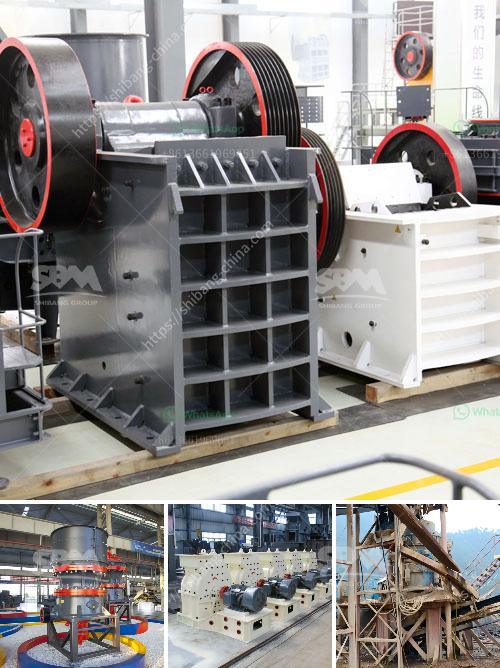

<h3>used iron ore impact crusher for hire</h3>
Mining companies and construction projects rely heavily on efficient crushing equipment to process a wide variety of materials, including iron ore. To achieve this, they often opt for reliable and robust crushers that can withstand the harsh conditions found in the mining industry. As equipment values can be significant, opting for used iron ore impact crushers for hire has emerged as a cost-effective solution for many operations. This article will explore the benefits and considerations when utilizing used iron ore impact crushers for hire.

One of the primary advantages of hiring used iron ore impact crushers is the cost savings compared to purchasing new equipment. By opting for used crushers, mining companies can significantly reduce their upfront investment while still having access to reliable machinery. The capital saved can be allocated towards other critical operations or technology upgrades, ultimately improving productivity and profitability.

Renting a used iron ore impact crusher also offers greater mobility and flexibility. Hiring crushers on a project-by-project basis allows mining and construction companies to transport the crusher to various sites, avoiding the need for permanent infrastructure. It grants the versatility to explore different ore deposits or construction projects without the burden of transporting large and heavy machinery.

When hiring used iron ore impact crushers, companies benefit from immediate availability. This eliminates the downtime typically associated with purchasing new equipment, as companies have to wait for manufacturing, transportation, and set-up. Hiring allows for instant access to reliable crushers, ensuring uninterrupted operations and enabling quick adaptation to varying demands.

Investing in used iron ore impact crushers for hire can serve as a risk mitigation strategy for mining companies. Instead of committing substantial capital to purchase new machinery, which may become obsolete or underutilized in the future, hiring crushers allows companies to evaluate the performance of the equipment before considering long-term commitments.

While there are numerous benefits of hiring used iron ore impact crushers, certain considerations should be taken into account:

1. Proper Maintenance Documentation: Ensure that the crusher comes with appropriate maintenance records, indicating regular servicing and repairs. This documentation will provide insight into the machine's history and reliability, reassuring you of its performance.

2. Equipment Inspection: Before committing to renting, conduct a thorough on-site inspection of the crusher's condition. Look for signs of wear and tear, check the functionality of vital components, and discuss any potential issues with the equipment provider.

3. Rental Terms and Agreements: Familiarize yourself with the rental terms, including costs, duration, and responsibilities. Evaluate what is covered by the rental agreement, such as maintenance or repairs, and ensure it aligns with your operational requirements.

Hiring used iron ore impact crushers presents a valuable opportunity for mining and construction companies seeking cost-effective and flexible crushing solutions. By leveraging these rental options, companies can access reliable machinery, reduce upfront costs, mitigate risks, and maintain uninterrupted operations. However, proper due diligence in terms of maintenance documentation and equipment inspections is essential to ensure optimal performance and a hassle-free rental experience.
<h3>Contact us</h3><ul><li><strong>Whatsapp:&nbsp;<a href="https://wa.me/8613661969651">+8613661969651</a></strong></li><li><a href="https://swt.shibang-china.com/?git&amp;zhl&amp;used iron ore impact crusher for hire"><strong>Online Service(chat now)</strong></a></li></ul><h3>Related</h3><ul><li><a href='crushing machines for ceramic.md'>crushing machines for ceramic</a></li><li><a href='caco3 carbonate calcium line production.md'>caco3 carbonate calcium line production</a></li><li><a href='singapore mining conveyor belt supplier.md'>singapore mining conveyor belt supplier</a></li><li><a href='transmission for ball mill.md'>transmission for ball mill</a></li><li><a href='used hammer mill in india.md'>used hammer mill in india</a></li></ul>