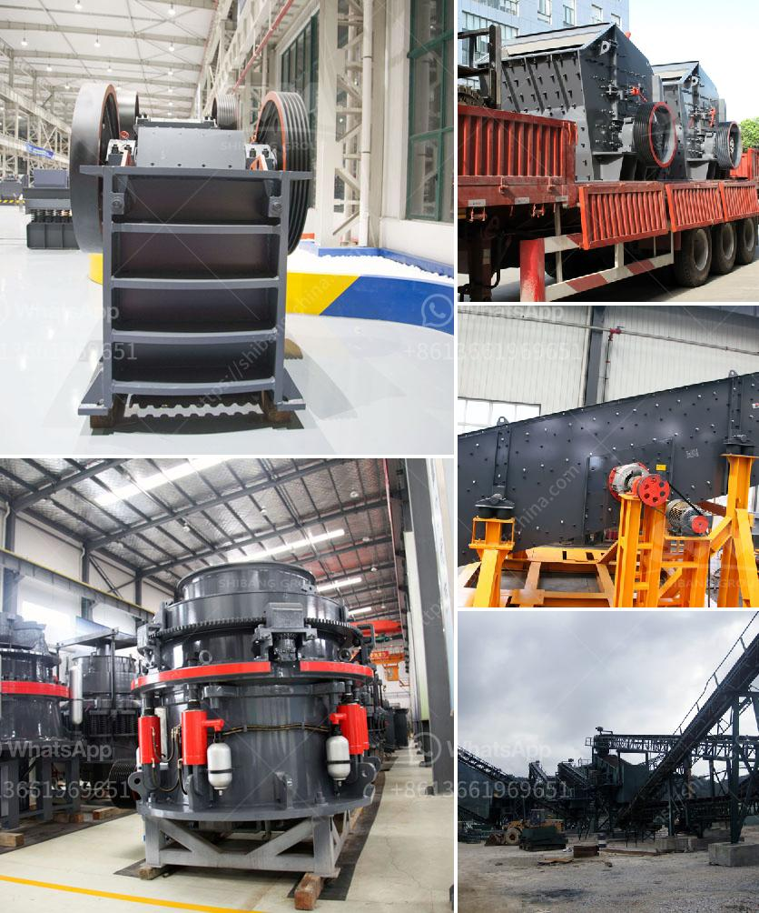

<h3>used jaw crusher japan</h3>
Japan is known for its strong industrial heritage and technological prowess. Over the years, the country has brought forth some of the most advanced and efficient machinery in various industries. One such industry where Japan excels is the mining and construction sector. In this article, we will discuss the used jaw crusher from Japan, a reliable and efficient machine for mining and construction purposes.

A jaw crusher is a primary crusher that breaks down large stones into small pieces. As the name suggests, it works by compressing the material between two plates to create smaller, more manageable fragments. These fragments are then used for various purposes, such as road construction, building materials, and concrete production.

Japan is renowned for its superior engineering and high-quality manufacturing. Used jaw crushers from Japan are no exception. Japanese manufacturers are known for their attention to detail, high precision, and durability. When it comes to crushers, Japan offers a wide range of options to suit various mining and construction requirements.

One of the key advantages of a used jaw crusher from Japan is its reliability. These machines are built to be strong and durable, capable of withstanding heavy-duty applications. They are designed to operate in challenging conditions and deliver consistent performance. This makes them ideal for mining operations that require continuous crushing of large rocks and stones.

Another advantage of a used jaw crusher from Japan is its efficiency. Japanese manufacturers are known for their focus on energy-saving technologies and optimization of machine performance. These crushers are designed to consume less power while delivering maximum productivity. This reduces the operational costs and increases profitability for mining and construction companies.

Used jaw crushers from Japan also offer the advantage of being versatile. These machines can handle a wide variety of materials, from soft rocks to hard stones. They can be used for various applications, such as primary crushing, secondary crushing, and even tertiary crushing. This versatility makes them a valuable asset in any mining or construction project.

In conclusion, a used jaw crusher from Japan is a reliable and efficient machine for mining and construction purposes. Japanese manufacturers are renowned for their engineering expertise and quality manufacturing, ensuring that these crushers deliver superior performance. With their durability, energy-saving features, and versatility, they are a valuable asset for any mining or construction company. If you are in need of a jaw crusher, consider exploring the options offered by Japanese manufacturers.
<h3>Contact us</h3><ul><li><strong>Whatsapp:&nbsp;<a href="https://wa.me/8613661969651">+8613661969651</a></strong></li><li><a href="https://swt.shibang-china.com/?git&amp;zhl&amp;used jaw crusher japan"><strong>Online Service(chat now)</strong></a></li></ul><h3>Related</h3><ul><li><a href='price and sales of quarry crusher in nigeria.md'>price and sales of quarry crusher in nigeria</a></li><li><a href='best machine for coal grinding.md'>best machine for coal grinding</a></li><li><a href='vibrator screen for coal.md'>vibrator screen for coal</a></li><li><a href='mining of copper crusher in sudan.md'>mining of copper crusher in sudan</a></li><li><a href='200tph vsi crushers.md'>200tph vsi crushers</a></li></ul>