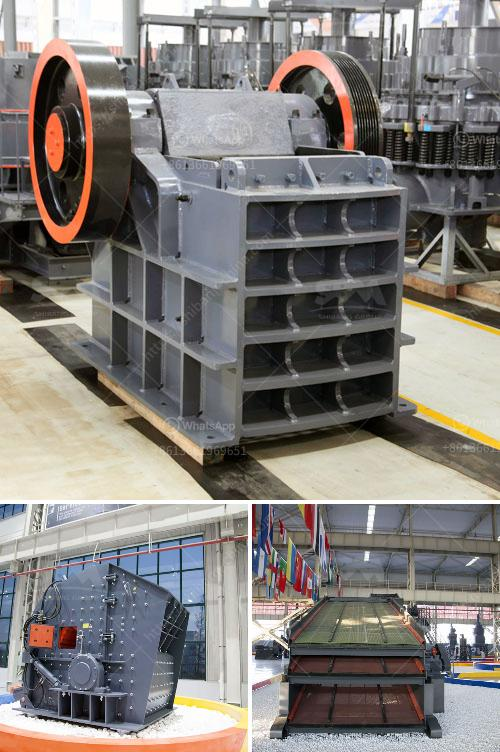

<h3>used jaw mobile crusher in uae</h3>
The mining and quarrying industry is always on the lookout for reliable and cost-effective machinery to improve efficiency and maximize profitability. Having a jaw mobile crusher in UAE is an important investment for companies that operate quarries and mines in the region.

A jaw crusher differentiates and extracts recyclable materials from construction waste materials. This machinery can crush any solid, including natural resources, concrete, and other heavy materials, reducing them into smaller parts before disposal or additional processing. By utilizing a mobile jaw crusher, businesses can avoid transportation costs and additional expenses, optimizing the resources at hand.

1. Versatility: Crushers are able to demolish concrete structures, mining ores, stones, and rocks onsite, saving transport costs and creating added value for contractors and project owners alike.

2. Efficiency: Mobile jaw crushers are built to efficiently reduce large-sized rocks into smaller particles to be further processed. In quarries and mines, these crushers are used to break ores down into finer particles, reducing the overall energy consumption and facilitating downstream operations.

3. Less Environmental Impact: Mobile jaw crushers significantly reduce emissions of particulate matter and improve local air quality. As the crushers are moved from one location to another, no groundwork or external power source is required, conserving energy and minimizing environmental impact.

4. Cost Savings: Investing in a used jaw mobile crusher is a cost-effective solution for miners and quarry operators alike. Available models may vary depending on region and availability, and versatility to handle various stone types and mineral ores is paramount. Additionally, jaw mobile crushers require low maintenance and can be easily maintained in-house, ensuring their longevity.

In UAE, jaw mobile crushers are widely used in the mining industry, as contractors, excavate and process natural minerals. Asphalt, concrete, slag, and brick waste are also crushed and recycled, which eliminates the need for costly transportation and disposal.

Significantly, a used jaw mobile crusher can easily be transported from one site to another, thus eliminating the need for transportation permits. This flexibility and adaptability make the crusher an important investment for businesses across the UAE.

Used jaw mobile crushers bring maximum benefits to businesses operating in the mining and quarrying industry, investing in this machinery can prove to be a cost-effective and efficient alternative to traditional methods. By reducing overall transport costs and optimizing resources, jaw mobile crushers are a valuable addition to any mining or quarrying operation in UAE.
<h3>Contact us</h3><ul><li><strong>Whatsapp:&nbsp;<a href="https://wa.me/8613661969651">+8613661969651</a></strong></li><li><a href="https://swt.shibang-china.com/?git&amp;zhl&amp;used jaw mobile crusher in uae"><strong>Online Service(chat now)</strong></a></li></ul><h3>Related</h3><ul><li><a href='silica sand production line stone crusher machine.md'>silica sand production line stone crusher machine</a></li><li><a href='used stone crusher ontario.md'>used stone crusher ontario</a></li><li><a href='cement plant in assam.md'>cement plant in assam</a></li><li><a href='second hand mobile crusher plant.md'>second hand mobile crusher plant</a></li><li><a href='removing iron from silica sand.md'>removing iron from silica sand</a></li></ul>