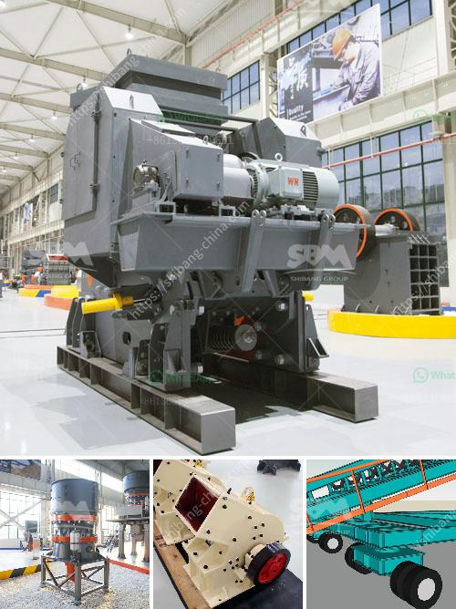

<h3>used mobile jaw crusher for sale uk</h3>
Are you looking for a reliable used mobile jaw crusher for sale in the UK? With its rugged and compact design, you can be rest assured that this machine will deliver the crushing capabilities you need. Whether you are in the construction, mining, or recycling industry, a used jaw crusher can help you achieve your goals.

A mobile jaw crusher can be easily transported from one location to another, making it an ideal choice for temporary construction sites or when you need to move between different worksites. With its powerful and efficient engine, this crusher provides exceptional crushing performance, enabling you to process various materials with ease.

One of the advantages of a used mobile jaw crusher is its versatility. It can handle a wide range of materials, including concrete, rubble, bricks, stone, limestone, and more. With adjustable jaw settings, you can easily control the size of the final product, ensuring that it meets your specific requirements.

Investing in a used jaw crusher is a cost-effective solution, as it allows you to access the same crushing capabilities as a new machine but at a lower price point. Additionally, by purchasing a used crusher, you can avoid the lengthy lead times associated with ordering a new machine.

When buying a used mobile jaw crusher, it is important to conduct a thorough inspection to ensure that it is in good working condition. Check the engine, hydraulic system, and any other vital components to ensure that they are functioning properly. Also, inspect the wear parts, such as the jaw plates, and replace them if necessary.

As with any used equipment, it is advisable to purchase from a reputable seller or dealer. They can provide you with the necessary information about the crusher's history, maintenance records, and any potential issues. This will give you peace of mind, knowing that you are investing in a reliable machine.

In conclusion, a used mobile jaw crusher can be a valuable asset for your business. Its versatility and portability make it suitable for various applications, while its cost-effectiveness makes it an attractive option for those on a budget. Take the time to research and inspect the crusher before making a purchase, and you'll be well on your way to finding a reliable crushing solution for your needs.
<h3>Contact us</h3><ul><li><strong>Whatsapp:&nbsp;<a href="https://wa.me/8613661969651">+8613661969651</a></strong></li><li><a href="https://swt.shibang-china.com/?git&amp;zhl&amp;used mobile jaw crusher for sale uk"><strong>Online Service(chat now)</strong></a></li></ul><h3>Related</h3><ul><li><a href='gravel screening equipment.md'>gravel screening equipment</a></li><li><a href='used jaw mobile crusher in uae.md'>used jaw mobile crusher in uae</a></li><li><a href='crusher machine 200 ton per hours.md'>crusher machine 200 ton per hours</a></li><li><a href='silica sand processing plant.md'>silica sand processing plant</a></li><li><a href='how much would it cost to start a gravel quarry.md'>how much would it cost to start a gravel quarry</a></li></ul>