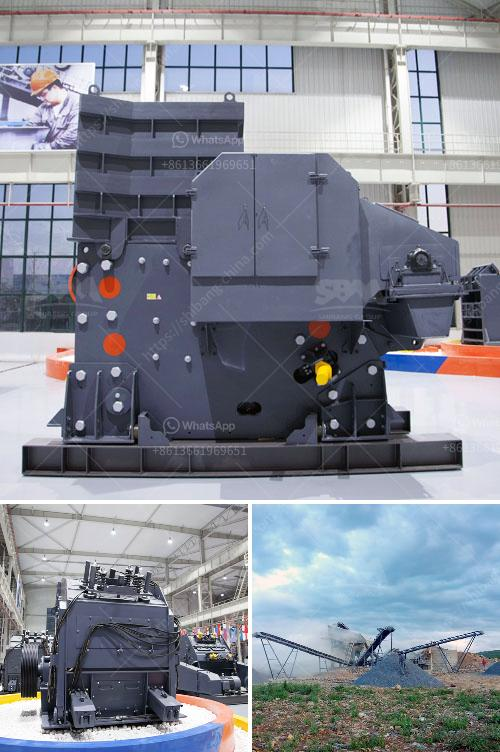

<h3>used portable crusher for sale south africa</h3>
In recent years, with the rapid development of the South African economy, infrastructure construction and industrialization have entered into a vigorous phase. As a crucial component of mining machinery, used portable crushers play an essential role in South Africa's mining industry. The demand for these versatile machines is on the rise, thereby presenting significant opportunities for both manufacturers and buyers.

When considering the purchase of a crusher, especially in the case of temporary projects or limited budgets, opting for a used portable crusher is a cost-effective solution. Compared to new models, used crushers often come at a significantly lower price point without compromising on functionality. By selecting a reliable and well-maintained machine, buyers can access high-quality equipment while saving a considerable amount of money.

One of the major advantages of used portable crushers is their versatility and adaptability. These crushers can be easily moved from one site to another, making them ideal for projects that require on-site crushing. Additionally, the availability of multiple attachments allows the crusher to complete a wide range of tasks, including concrete recycling, rock crushing, gravel production, and more. The ability to transform the same machine to suit various applications offers increased operational flexibility and optimizes productivity.

South Africa, like many other countries, is increasingly prioritizing environmental sustainability. By choosing a used portable crusher, buyers contribute to the pursuit of this objective. These crushers are designed to be energy-efficient, minimizing energy consumption during operation. Furthermore, using a used machine promotes the idea of recycling and reusing equipment, reducing the carbon footprint and waste generated by industrial activities.

When purchasing a used portable crusher, buyers have the opportunity to refurbish the machine according to their specific requirements. This includes the option to update or install additional components that align with the latest technological advancements. By giving a second life to a used crusher, buyers can customize it to meet their exact needs, enhancing its overall performance and extending its operational lifespan.

Another benefit of choosing used portable crushers in South Africa is the easy accessibility to a wide range of spare parts and maintenance services. The country has a well-established network of suppliers and engineers who specialize in providing these services. This ensures that buyers have access to the necessary support required to keep their crushers operating at peak performance. Moreover, there are numerous online platforms and marketplaces where buyers can easily find spare parts, simplifying the maintenance process.

Used portable crushers offer an attractive solution for construction companies and mining operations in South Africa. The combination of cost-effectiveness, versatility, reduced environmental impact, and access to spare parts and maintenance services makes them a smart choice. As the demand for portable crushers continues to rise, buyers can capitalize on these advantages to enhance their operational efficiency and maintain a competitive edge.
<h3>Contact us</h3><ul><li><strong>Whatsapp:&nbsp;<a href="https://wa.me/8613661969651">+8613661969651</a></strong></li><li><a href="https://swt.shibang-china.com/?git&amp;zhl&amp;used portable crusher for sale south africa"><strong>Online Service(chat now)</strong></a></li></ul><h3>Related</h3><ul><li><a href='materials hammer mill.md'>materials hammer mill</a></li><li><a href='stone crusher machine price in ethiopia.md'>stone crusher machine price in ethiopia</a></li><li><a href='aggregates plant for construction.md'>aggregates plant for construction</a></li><li><a href='sand washing machine zenith.md'>sand washing machine zenith</a></li><li><a href='crushers for sale in south africa.md'>crushers for sale in south africa</a></li></ul>