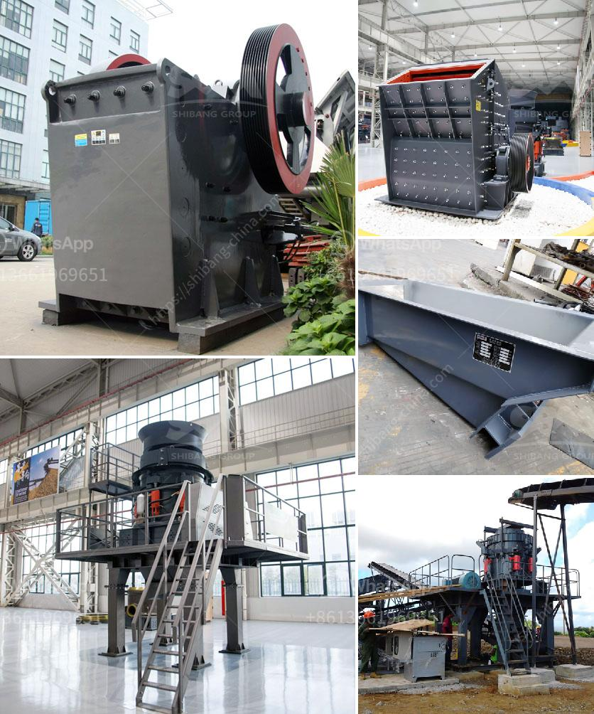

<h3>used portable crushing plant for sale philippines</h3>
Portable crushing plant for sale Philippines is the most common kind of crushing equipment and is widely used in many industries like mining, metallurgy, building materials, transportation and water conservancy. If you're looking for a reliable and efficient portable crushing plant for sale, the Philippines is the right place to come.

Portable crushing plants are highly versatile and are able to be used for crushing various types of stones and ores. These plants are designed and manufactured to meet specific requirements of different customers. They can be easily transported from one location to another and can be set up quickly, making them ideal for short-term or longer-term projects.

One of the main advantages of portable crushing plants is their ability to crush materials on-site, which eliminates the need for transportation of materials to and from the crushing site. This not only saves time and money but also reduces the environmental impact of hauling materials. Some portable crushing plants are designed to be compact and lightweight, making them easy to transport even in small spaces.

Another advantage of portable crushing plants is their flexibility in handling different materials. They can be used to crush a wide range of materials, including concrete, asphalt, rocks, and even demolition waste. The flexibility of these plants allows them to be used in various applications, such as construction projects, road and bridge construction, and mining operations.

When looking for a used portable crushing plant for sale in the Philippines, it's important to consider factors such as the size, power, and capacity of the machine. The size determines the maximum feed size that the machine can handle, while the power determines the crushing capacity. The capacity refers to the amount of material that the machine can process in a given period.

It's also important to consider the condition of the portable crushing plant before making a purchase. You should inspect the machine thoroughly to ensure that it is in good working condition and free from any mechanical issues. This will help ensure that you get a reliable and efficient machine that can perform to your expectations.

In conclusion, used portable crushing plants offer many advantages over traditional stationary crushing plants. They offer flexibility, portability, and the ability to crush materials on-site. If you're in the market for a used portable crushing plant, the Philippines is a great place to find one. With a wide range of options available, you can find a machine that meets your specific needs and budget.
<h3>Contact us</h3><ul><li><strong>Whatsapp:&nbsp;<a href="https://wa.me/8613661969651">+8613661969651</a></strong></li><li><a href="https://swt.shibang-china.com/?git&amp;zhl&amp;used portable crushing plant for sale philippines"><strong>Online Service(chat now)</strong></a></li></ul><h3>Related</h3><ul><li><a href='the cost of the stone crusher machine.md'>the cost of the stone crusher machine</a></li><li><a href='ball mills for rent.md'>ball mills for rent</a></li><li><a href='stamp mill foot for sale.md'>stamp mill foot for sale</a></li><li><a href='dolomite crushing machine.md'>dolomite crushing machine</a></li><li><a href='quartz powder in ball mill.md'>quartz powder in ball mill</a></li></ul>