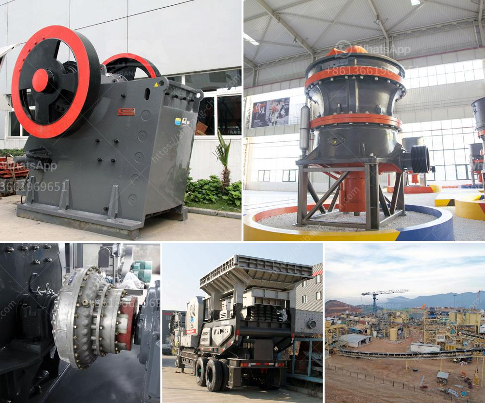

<h3>used raymond mill for sale in taiwan crusher</h3>
Raymond mills are widely used in the milling and processing of various non-metallic minerals with the hardness below 7 and humidity below 6%, such as marble, limestone and dolomite, Its grinding range is better than that of traditional mills, and its production capacity is higher. With the continuous improvement and upgrading of the technology and performance of Raymond mills, they have become more and more popular in the market. 

However, buying a brand-new Raymond mill may not always be affordable for everyone. That's where used Raymond mills come into play. Used Raymond mills can provide an efficient and cost-effective solution for those who need to grind materials but have a limited budget. Taiwan is known for producing high-quality machinery, and used Raymond mills from Taiwan are also highly sought after in the market.

The used Raymond mill for sale in Taiwan has many advantages. Firstly, it is equipped with a complete set of grinding equipment, which includes jaw crusher, bucket elevator, electromagnetic vibrating feeder and electric control cabinet. The auxiliary equipment cooperates with the Raymond mill to make the production process more efficient and improve the output and quality of the finished products.

Secondly, the used Raymond mill is in good condition and has a long service life. The high-quality materials and advanced manufacturing technology ensure the stability and durability of the equipment. The used Raymond mill can still perform well even after years of use, which makes it a reliable choice for buyers.

In addition, buying a used Raymond mill can save a lot of money. Compared with a new mill, the price of a used mill is generally much lower. For those who are starting a new business or expanding their production capacity, buying a used mill can be a cost-effective option. The saved money can be used for other purposes, such as purchasing raw materials or hiring more employees.

When purchasing a used Raymond mill from Taiwan, there are a few things to keep in mind. Firstly, it is important to thoroughly inspect the equipment before making a decision. Check the overall condition of the mill and its components, including the grinding ring, grinding roller, bearings, motor, and electrical components. Ensure that there are no major issues or damages that may affect the performance and safety of the mill.

Secondly, inquire about the maintenance history of the used Raymond mill. Ask the seller about the regular maintenance and repairs that have been done on the equipment. A well-maintained mill is more likely to have a longer service life and better performance.

Lastly, consider the reputation and credibility of the seller. It is advisable to buy from a reputable seller or dealer who has a good track record in selling used machinery. This helps to ensure a smooth transaction and reliable after-sales service.

In conclusion, buying a used Raymond mill for sale in Taiwan can be a practical and cost-effective solution for those in need of grinding equipment. With proper inspection and consideration, a used mill can provide excellent performance at a fraction of the cost of a new mill, allowing businesses to save money while still achieving their production goals.
<h3>Contact us</h3><ul><li><strong>Whatsapp:&nbsp;<a href="https://wa.me/8613661969651">+8613661969651</a></strong></li><li><a href="https://swt.shibang-china.com/?git&amp;zhl&amp;used raymond mill for sale in taiwan crusher"><strong>Online Service(chat now)</strong></a></li></ul><h3>Related</h3><ul><li><a href='kenya jaw crushers south africa.md'>kenya jaw crushers south africa</a></li><li><a href='ore beneficiation equipment suppliers china.md'>ore beneficiation equipment suppliers china</a></li><li><a href='500 tph jaw crusher for sale.md'>500 tph jaw crusher for sale</a></li><li><a href='smallest gold crushing and washing plant.md'>smallest gold crushing and washing plant</a></li><li><a href='efficiency energetic efficiency of roller mill.md'>efficiency energetic efficiency of roller mill</a></li></ul>