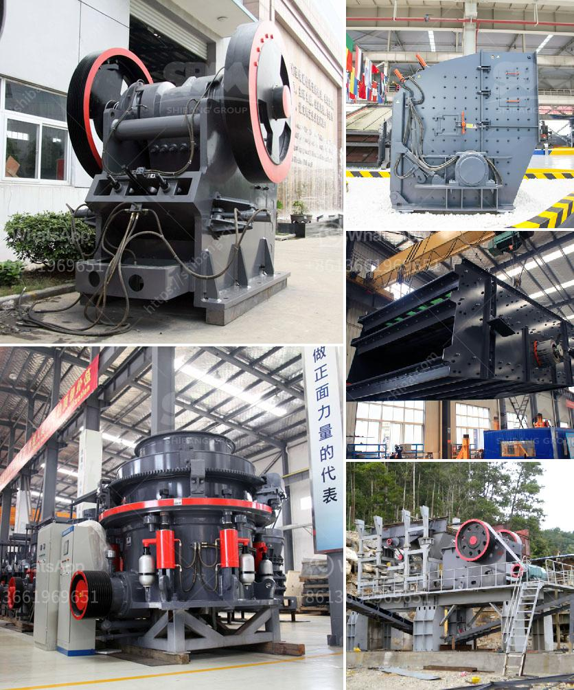

<h3>used sand screening equipment for sale</h3>
Used sand screening equipment is widely used in construction, mining, and other industries for the purpose of separating materials based on their size. It plays an important role in the overall production process, as it helps to ensure the quality and consistency of the final product. The availability of used sand screening equipment for sale provides a cost-effective solution for businesses looking to enhance their operations without incurring additional expenses.

One of the main advantages of investing in used sand screening equipment is the reduced upfront cost. New equipment can be expensive, and not all businesses have the financial resources to purchase it. By opting for used equipment, companies can save a substantial amount of money and allocate those funds towards other aspects of their operations. This is particularly beneficial for smaller businesses or start-ups that may have limited budgets.

Another advantage of buying used equipment is the immediate availability. New equipment often has longer lead times, as it may need to be manufactured or imported. In contrast, used equipment is readily available and can be acquired relatively quickly. This allows companies to streamline their operations and minimize any potential downtime.

Additionally, used sand screening equipment for sale is typically in good condition and can still offer optimal performance. It is common for businesses to upgrade their equipment after a certain period, even if the existing machines are still functional. This could be due to factors such as technological advancements, changes in production requirements, or the need for higher capacity equipment. As a result, used equipment in the market is often well-maintained, well-functioning, and can provide the same level of performance as new equipment.

Furthermore, purchasing used sand screening equipment allows businesses to try out different brands or models without investing a significant amount of money. This enables companies to evaluate the equipment's suitability for their specific needs before committing to a long-term investment. If the equipment exceeds expectations, businesses can consider upgrading to a new unit in the future.

When considering used sand screening equipment for sale, it is important to conduct thorough research and deal with reputable sellers. It is advisable to examine the equipment's condition, history, and maintenance records before making a purchase. This information can provide insights into the overall quality and expected lifespan of the equipment.

In conclusion, used sand screening equipment for sale offers several advantages for businesses in need of reliable and cost-effective solutions. It provides a more affordable option compared to purchasing new equipment, allows for immediate availability, and can still deliver optimal performance. By investing in used equipment, businesses can enhance their operations efficiently and effectively. However, it is crucial to exercise caution and conduct due diligence when selecting and purchasing used equipment to ensure its reliability and longevity.
<h3>Contact us</h3><ul><li><strong>Whatsapp:&nbsp;<a href="https://wa.me/8613661969651">+8613661969651</a></strong></li><li><a href="https://swt.shibang-china.com/?git&amp;zhl&amp;used sand screening equipment for sale"><strong>Online Service(chat now)</strong></a></li></ul><h3>Related</h3><ul><li><a href='marble grinding mills machine.md'>marble grinding mills machine</a></li><li><a href='how to calculate tph of a cone crusher.md'>how to calculate tph of a cone crusher</a></li><li><a href='small scale cement plants in india.md'>small scale cement plants in india</a></li><li><a href='3 roller mill manufacturers in india.md'>3 roller mill manufacturers in india</a></li><li><a href='cost of a jaw crusher in india.md'>cost of a jaw crusher in india</a></li></ul>