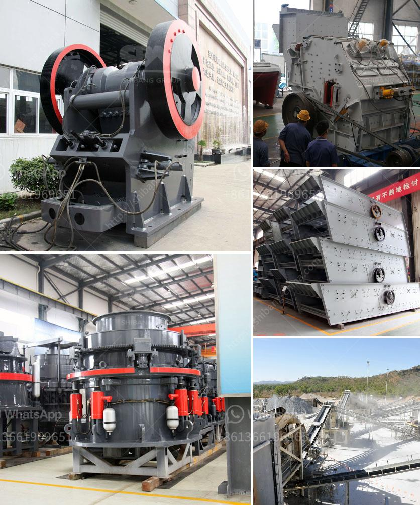

<h3>used sand wash plant for sale in texas</h3>
If you are in the market for a used sand wash plant for sale in Texas, you are not alone. The demand for high-quality sand and gravel is increasing steadily, and with it, the need for efficient and cost-effective processing plants. A used sand wash plant can be a great investment, allowing you to save money over buying a new plant while still achieving the same results.

A sand wash plant is a piece of equipment used to wash sand particles and remove impurities such as clay or silt. It is commonly used in the construction industry to clean concrete, gravel, or crushed stone. Coarse sand is typically used as the base material for concrete, and washing it helps to remove any trapped debris, resulting in a cleaner and stronger final product.

There are several factors to consider when looking for a used sand wash plant for sale in Texas. First and foremost, you should assess the condition of the plant. Look for any signs of wear and tear, as well as any repairs or modifications that may have been done. It is essential to carefully inspect each component, including the screening equipment, washer, and conveyor belts, to ensure they are in good working condition.

Another critical factor to consider is the capacity of the plant. How much sand can it process per hour, and is it suitable for the volume of material you need to wash? Your specific requirements will depend on the scale of your operations and the anticipated demand for sand. Assessing the plant's capacity will help you determine if it is suitable for your needs.

In addition to the equipment itself, you should also consider the location of the used sand wash plant in Texas. Ideally, you want a plant that is close to your source of raw material to minimize transportation costs. Additionally, check if there are any legal or environmental regulations that may restrict the operation of the plant in the area.

When buying a used sand wash plant, it is essential to do your due diligence. Research the seller's reputation and ask for any documentation or maintenance records they may have. If possible, visit the plant in person to see it in operation and speak with the owner or operator. These steps will help ensure that you are making a smart investment and that the plant will meet your needs.

Finally, don't forget to consider your budget when searching for a used sand wash plant for sale in Texas. Determine your maximum spending limit and be prepared to negotiate the price. Remember that while a used plant may be cheaper than a new one, it is still a significant investment, and you should aim for the best value for money.

In conclusion, purchasing a used sand wash plant in Texas can be a cost-effective solution for your sand washing needs. However, it is crucial to thoroughly evaluate the plant's condition, capacity, and location before making a purchase. By following these guidelines and conducting thorough research, you can find a suitable plant that will help you attain clean and high-quality sand efficiently.
<h3>Contact us</h3><ul><li><strong>Whatsapp:&nbsp;<a href="https://wa.me/8613661969651">+8613661969651</a></strong></li><li><a href="https://swt.shibang-china.com/?git&amp;zhl&amp;used sand wash plant for sale in texas"><strong>Online Service(chat now)</strong></a></li></ul><h3>Related</h3><ul><li><a href='costs of ball mills.md'>costs of ball mills</a></li><li><a href='cyanide processing plants for sale usa.md'>cyanide processing plants for sale usa</a></li><li><a href='stone grinding plant equipment specification.md'>stone grinding plant equipment specification</a></li><li><a href='mining equipment companies in nigeria.md'>mining equipment companies in nigeria</a></li><li><a href='low productivity jaw crusher.md'>low productivity jaw crusher</a></li></ul>