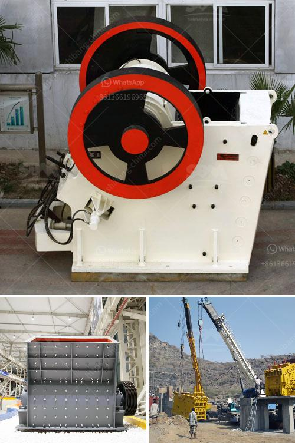

<h3>used stone crusher for sale in italy</h3>
In recent years, the demand for used stone crushers in Italy has experienced a significant increase. With Italy's growing industrial development, the stone crusher industry has also been developing rapidly, resulting in large quantities of used stones, which need to be crushed in order to be utilized for other construction purposes.

Since Italy is known for its picturesque landscapes and historically rich cities, there is a constant need for restoration and construction work. This has boosted the demand for crushers as they play a crucial role in transforming large rocks into smaller stones that are used for laying foundations and building structures. These crushers are also used in road construction projects and maintenance work.

Used stone crushers for sale in Italy have a wide application range. Due to the increasing demand for machinery in quarries and mines, they are widely used in the mining industry as well as in construction sites. In Italy, several manufacturers offer high-quality crushers that guarantee reliability and long service life.

Thanks to their robust designs and advanced technology, these crushers can easily handle heavy-duty tasks. From reducing the size of large rocks to providing the desired grain size, these machines greatly improve the efficiency of construction processes. Moreover, they are equipped with safety features that ensure the protection of workers and prevent accidents.

When purchasing a used stone crusher in Italy, it is essential to conduct a thorough inspection of the machine to ensure that it is in good working condition. Important factors to consider include the crusher's age, the number of hours it has been used, and its maintenance history. By doing so, buyers can make an informed decision and avoid any potential issues in the future.

In conclusion, the market for used stone crushers in Italy is growing and will continue to do so in the foreseeable future. As the demand for crushed stones increases, Italian manufacturers are providing high-quality products that meet the needs of the construction and mining industries. With the right maintenance and care, these machines can serve businesses for years, providing efficient and reliable crushing solutions.
<h3>Contact us</h3><ul><li><strong>Whatsapp:&nbsp;<a href="https://wa.me/8613661969651">+8613661969651</a></strong></li><li><a href="https://swt.shibang-china.com/?git&amp;zhl&amp;used stone crusher for sale in italy"><strong>Online Service(chat now)</strong></a></li></ul><h3>Related</h3><ul><li><a href='used stone crushers for sale in accra.md'>used stone crushers for sale in accra</a></li><li><a href='manganese metal production process.md'>manganese metal production process</a></li><li><a href='business proposal preparation for mobile crusher.md'>business proposal preparation for mobile crusher</a></li><li><a href='price of crusher of stone in peru.md'>price of crusher of stone in peru</a></li><li><a href='processing on barite crushing.md'>processing on barite crushing</a></li></ul>