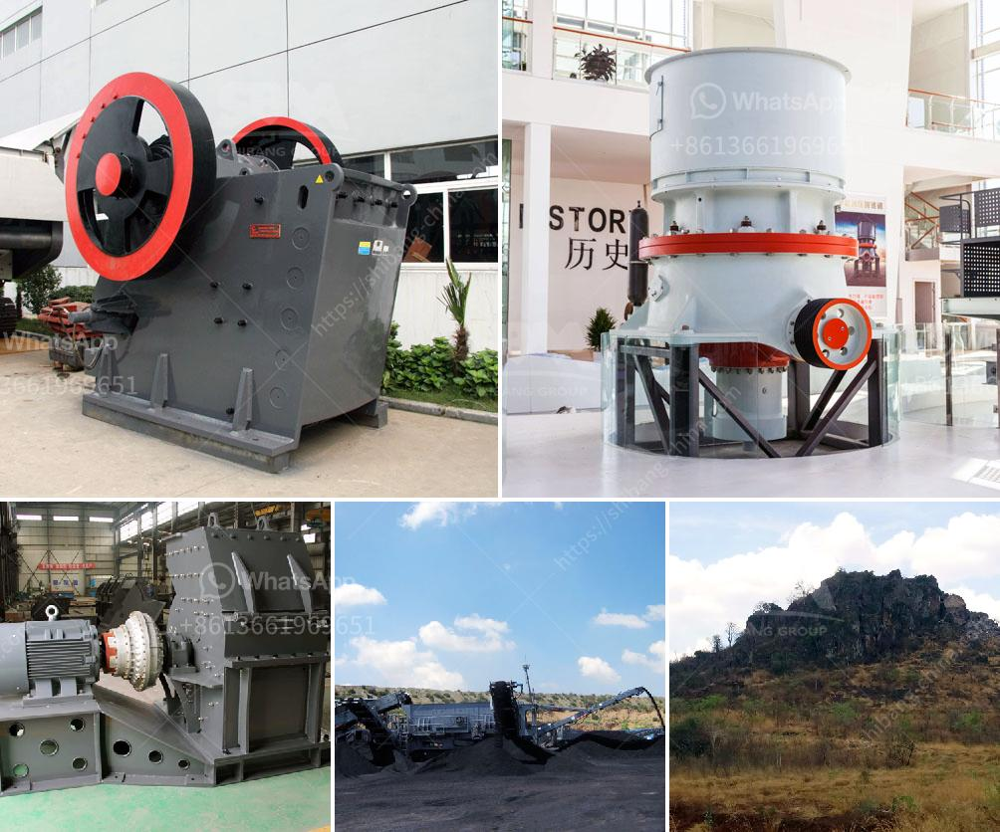

<h3>used stone crusher for sale in usa</h3>
Stone crushers are widely used in various material processing operations in the mining and construction industries. These applications include hard rock crushing, aggregate production, building materials recycling, and many more. In the USA, stone crushers are especially popular, as stone crushing equipment is extensively used in crushing various materials like rocks, ores, and minerals.

Stone crushers for sale in the USA include jaw crusher, impact crusher, cone crusher, hammer crusher, VSI crusher, and mobile crusher. All these stone crushers are very efficient for crushing various types of stones, such as limestone, granite, basalt, and river gravel. With the continuous development of mining technology, new stone crushers are constantly being developed to further improve their performance.

One popular type of stone crusher in the USA is the cone crusher. This machine utilizes a compression force to reduce the size of the stones into finer particles. The crushed materials can be used for various purposes, such as road construction, landscaping, and concrete production. The cone crusher is highly efficient and can produce excellent particle shapes. It is suitable for both secondary and tertiary crushing stages.

Another common type of stone crusher in the USA is the jaw crusher. This machine uses compressive force to crush the stones, and it is characterized by its high reduction ratio and large crushing capacity. Jaw crushers are widely used in various quarries, mines, and construction sites, and they are commonly used to crush various rock materials, including granite, basalt, limestone, river gravel, and more.

When looking for a used stone crusher for sale in the USA, there are a few important considerations to be made. Firstly, the size of the stone crusher is a crucial factor. A bigger stone crusher is generally capable of crushing rocks of larger size. Secondly, the price of the stone crusher should be taken into consideration. While price depends on many factors, such as the type of crusher, capacity, and condition, it is always essential to determine whether it fits within your budget.

In conclusion, used stone crushers can be an excellent choice if you need a reliable and efficient crushing solution. Whether it is for construction, mining, or recycling applications, there are various types and models of stone crushers available in the USA. By considering your specific needs and budget, you can easily find a suitable used stone crusher for sale and enhance your productivity and profitability.
<h3>Contact us</h3><ul><li><strong>Whatsapp:&nbsp;<a href="https://wa.me/8613661969651">+8613661969651</a></strong></li><li><a href="https://swt.shibang-china.com/?git&amp;zhl&amp;used stone crusher for sale in usa"><strong>Online Service(chat now)</strong></a></li></ul><h3>Related</h3><ul><li><a href='vsi crusher manufacturer.md'>vsi crusher manufacturer</a></li><li><a href='rock stone crusher.md'>rock stone crusher</a></li><li><a href='hard rock crushers manufacturers india.md'>hard rock crushers manufacturers india</a></li><li><a href='clay grinding plant.md'>clay grinding plant</a></li><li><a href='japan crushing machine manufacturers list.md'>japan crushing machine manufacturers list</a></li></ul>