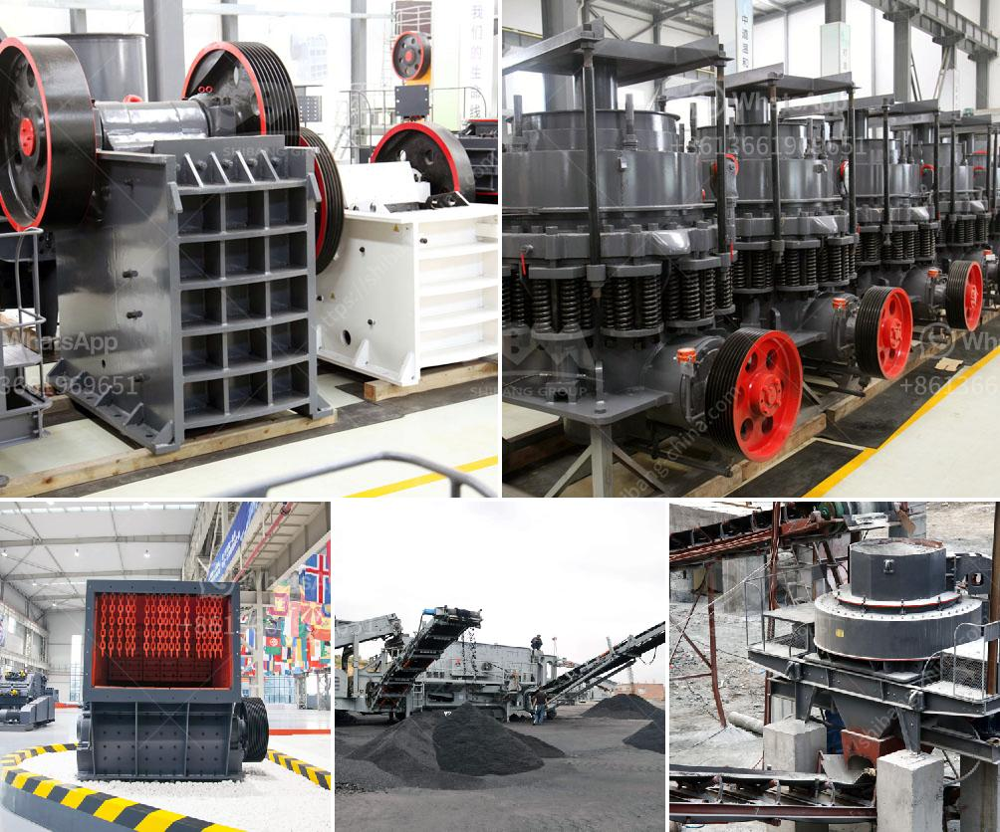

<h3>used stone crusher in ontario</h3>
Ontario, the largest province in Canada, has a rich mining industry. For over a century, Ontario has produced substantial amounts of gold, nickel, copper, and other valuable minerals. Many of these valuable resources are found in the hard rock deposits, which require crushing to extract the minerals. This is where a used stone crusher becomes essential.

The used stone crusher in Ontario is ideally suited for primary and secondary crushing. It is capable of crushing various materials with compressive strength less than 320MPa. The used stone crusher in Ontario can be applied to all kinds of ores, cement, refractories, bauxite clinker, glass raw materials, building sand, construction aggregate, sand, metallurgical and other industries. It is especially suitable for high-efficiency fine crushing for hard and brittle materials such as iron ore, lead ore, zinc ore, copper ore, manganese ore, diamond, gold ore, and coal, etc.

When choosing a used stone crusher for sale in Ontario, it is important to consider the equipment condition and performance. High performance machinery requires regular maintenance and repairs to ensure its longevity and reliability. Additionally, it is crucial to check the spare parts availability and pricing, as well as the overall cost of ownership.

Used stone crushers in Ontario are commonly equipped with advanced technologies such as hydraulic systems, intelligent control, and lubrication systems. These features enhance the crusher's performance and provide ease of use and maintenance. Furthermore, the adjustable discharge opening and overload protection system allow for efficient crushing operations and prevent damage to the crusher.

In addition to the technical aspects, the location of the used stone crusher in Ontario is another crucial factor to consider. Ontario has many regions with active mining operations, such as the Sudbury Basin, Timmins, and Kirkland Lake, among others. Purchasing a used stone crusher in close proximity to the mining sites can significantly reduce transportation costs and improve overall efficiency.

When looking for a used stone crusher in Ontario, it is advisable to consult with reputable equipment dealers or manufacturers. They can provide valuable insights and guidance based on their expertise and experience. Additionally, they often offer warranties and after-sales services, ensuring peace of mind for the buyer.

In conclusion, the use of a used stone crusher in Ontario is a cost-effective solution for mining operations in the province. With the rich mining resources and strong demand for minerals, the need for crushing equipment is ever-present. By considering the condition, performance, location, and after-sales support, buyers can find a suitable used stone crusher to meet their demands and optimize their mining operations.
<h3>Contact us</h3><ul><li><strong>Whatsapp:&nbsp;<a href="https://wa.me/8613661969651">+8613661969651</a></strong></li><li><a href="https://swt.shibang-china.com/?git&amp;zhl&amp;used stone crusher in ontario"><strong>Online Service(chat now)</strong></a></li></ul><h3>Related</h3><ul><li><a href='china ball valve grinding machine.md'>china ball valve grinding machine</a></li><li><a href='harga sewa beli stone crusher kapasitas 30 ton per jam.md'>harga sewa beli stone crusher kapasitas 30 ton per jam</a></li><li><a href='crusher in sri lanka.md'>crusher in sri lanka</a></li><li><a href='high efficiency 200tph jaw crusher with great price.md'>high efficiency 200tph jaw crusher with great price</a></li><li><a href='manufacturing talcum powder in india.md'>manufacturing talcum powder in india</a></li></ul>