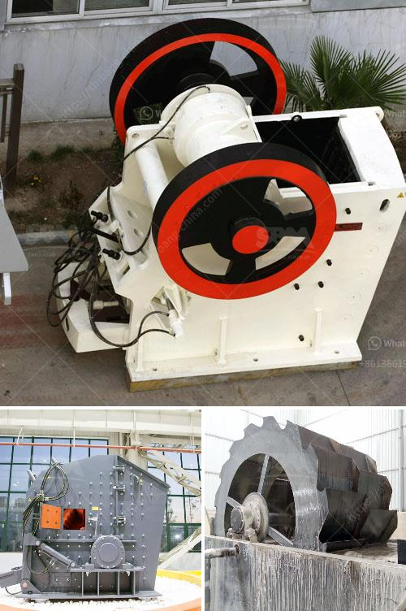

<h3>used stone crusher machine for sale in uae</h3>
As the technological leader, Greenwill Machinery has been designing and manufacturing crushing equipment for over 30 years. The company specializes in the production of a wide range of machinery for the mining and construction industry including crushers, screens, feeders, and conveyor belts. With a strong focus on energy efficiency and durability, Greenwill Machinery has earned a reputation for producing high-quality equipment that delivers outstanding performance.

One of the most popular stone crushing machines used in mining, metallurgy, construction, road construction, and other industries is the stone crusher machine. Stone crushing machines are highly efficient and require less maintenance than other types of crushers. They are reliable, durable, and can be used in various environments, making them highly versatile.

Greenwill Machinery offers a range of stone crusher machines for sale in UAE. We provide the best-rated crushers in the industry. Our dedicated team of engineers, along with customer support, ensures outstanding customer satisfaction. Our stone crusher machines are used in over 40 countries worldwide, enabling us to gain a vast knowledge and expertise in the market.

When looking for a used stone crusher machine for sale, one of the most important factors to consider is the overall quality of the equipment. It's essential for the crusher to be in good working condition. It should have low hours of operation to ensure that it will last for many years to come. Additionally, the machine should be well-maintained and regularly serviced to avoid any unforeseen breakdowns.

Buying a used stone crusher machine from a reputable company like Greenwill Machinery ensures that you are investing in a high-quality product that will meet your needs. We thoroughly inspect all our used machines to ensure they are in excellent condition. Our team of experienced technicians performs comprehensive checks to ensure that all the components and systems are in good working order. This includes inspecting the engine, hydraulic system, electrical system, and all other crucial components.

Our used stone crusher machines come with a warranty to provide peace of mind and confidence in your purchase. We stand behind the quality of our equipment and are committed to providing excellent after-sales service. Our team is always available to assist you with any inquiries, technical support, or spare parts requirements.

Investing in a used stone crusher machine for sale in UAE can help you expand your business and increase your revenue. Our team at Greenwill Machinery is ready to assist you in finding the best solution that meets your specific requirements. Whether you need a single machine or a complete crushing and screening plant, we have the knowledge and expertise to guide you through the entire process.

To conclude, the stone crusher machine for sale in UAE offered by Greenwill Machinery is an investment opportunity that should not be overlooked. With its high efficiency, durability, and versatile design, it can help your business thrive and succeed in the competitive market. Contact Greenwill Machinery today to explore the range of stone crusher machines available and take advantage of this valuable opportunity.
<h3>Contact us</h3><ul><li><strong>Whatsapp:&nbsp;<a href="https://wa.me/8613661969651">+8613661969651</a></strong></li><li><a href="https://swt.shibang-china.com/?git&amp;zhl&amp;used stone crusher machine for sale in uae"><strong>Online Service(chat now)</strong></a></li></ul><h3>Related</h3><ul><li><a href='price hammer crusher nigeria.md'>price hammer crusher nigeria</a></li><li><a href='gold crusher plant for sale australia.md'>gold crusher plant for sale australia</a></li><li><a href='for sale stone crusher in sri lanka.md'>for sale stone crusher in sri lanka</a></li><li><a href='fine powder milling machines.md'>fine powder milling machines</a></li><li><a href='made in germany stone crusher.md'>made in germany stone crusher</a></li></ul>