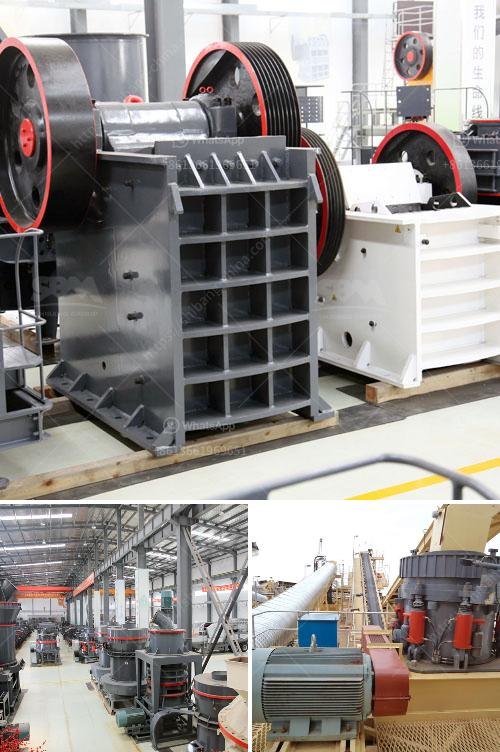

<h3>used stone crusher machine in italia</h3>
The stone crusher machine is widely used in mining, metallurgy, construction, chemical, power, metallurgical, and other industries. It can crush various materials with a compressive strength of less than 320 MPa. The stone crusher machine is suitable for crushing medium-hardness materials such as limestone, slag, coke, coal and so on in cement, chemical, electric power, metallurgy and other industrial departments.

Used stone crusher machine in Italia is actually a common sight in mining and construction sites. It is generally utilized in the crushing of waste material into smaller pieces for disposal or recycling purposes. As the Italian crusher equipment industry continues to evolve, it is necessary to maintain product innovation to continue to gain market share.

The used stone crusher machine in Italia has larger crushing ratio and higher crushing efficiency behind the simple structure. It has the advantages of high yield, low energy consumption, and high equipment quality. It is easy to operate and maintain, making it popular among the mining machinery manufacturers.

The used stone crusher machine in Italia is also equipped with a crusher plate that is easy to replace and wear, greatly reducing maintenance costs. It is the best choice for users to choose the crusher machine with a long service life.

Skip in 23432Italy's used stone crusher machine has high quality and stable performance. It has high hardness material crushing process in the cement industry. It takes a long time to stay in the crushing chamber, thus greatly reducing the wear of the machine. Consumable parts and reducing maintenance costs, it is economical and reliable.

In summary, the used stone crusher machine in Italia has the above advantages. It has flexible combination and wide application range. It provides customers with efficient and low-cost engineering equipment. It is the best choice for customers and manufacturers to choose Italian machinery.
<h3>Contact us</h3><ul><li><strong>Whatsapp:&nbsp;<a href="https://wa.me/8613661969651">+8613661969651</a></strong></li><li><a href="https://swt.shibang-china.com/?git&amp;zhl&amp;used stone crusher machine in italia"><strong>Online Service(chat now)</strong></a></li></ul><h3>Related</h3><ul><li><a href='jaw crusher vs cone crusher.md'>jaw crusher vs cone crusher</a></li><li><a href='powder making machinery.md'>powder making machinery</a></li><li><a href='crusher processing plant malaysia.md'>crusher processing plant malaysia</a></li><li><a href='crusher machines for granite in nigeria.md'>crusher machines for granite in nigeria</a></li><li><a href='mill ore grind size passing 200 mesh.md'>mill ore grind size passing 200 mesh</a></li></ul>