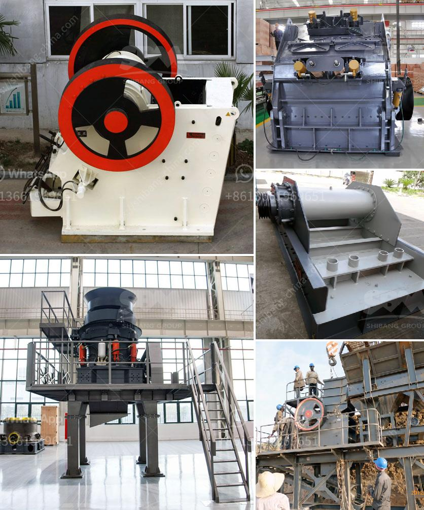

<h3>used stone crusher machine japan</h3>
Japan is a country that is well-known for its thriving industrial sector, which is why it comes as no surprise that the country is the leading exporter of used stone crusher machines. The majority of these machines are exported to countries outside of Japan, such as those in the Middle East, Africa, and Asia.

What sets Japanese used stone crusher machines apart is the sheer quality and durability of these machines. A stone crusher is a heavy machine used to reduce large rocks into smaller rocks, gravel, or rock dust. Crushers may be used to reduce the size, or change the form, of stones, and waste materials, so it can be easily disposed of or recycled, or reduce the size of a solid mix of raw materials, making it easier to differentiate the materials, so as to be used in various industries.

The Japanese used stone crusher machines are highly regarded for their durability, advanced features, and reliability. To meet the diverse needs of customers, these machines are available in a variety of sizes, designs, and power capacities. Some common types of stone crushers found in the Japanese market include the gyratory crusher, jaw crusher, cone crusher, and impact crusher.

The gyratory crusher is the most widely used machine for primary crushing of stones. It operates by pressing the stones against a concave surface within the crushing chamber. The gyratory crusher can produce large quantities of uniformly fine crushed stone, making it ideal for use in construction projects such as roads, bridges, and buildings.

The jaw crusher is another widely used machine that utilizes a compressive force to crush stones. It consists of two vertical jaws, one fixed and the other moving, which simulate the movement of jaws when chewing food. Jaw crushers are primarily used for breaking down big rocks into manageable sizes and can be used in diverse industries such as mining, construction, and recycling.

The cone crusher, on the other hand, is a versatile machine that is commonly used for secondary or tertiary crushing of stones. It resembles a cone-shaped bowl with a smaller crushing cavity. The cone crusher is perfect for producing crushed stones of consistent quality for use in road construction, concrete production, and asphalt production.

Lastly, the impact crusher is widely used for crushing stones with medium hardness levels. It exerts a high amount of impact force on the stones, causing them to break into smaller pieces. The impact crusher is commonly used in mining, metallurgy, construction, and chemical industries.

In conclusion, the used stone crusher machines produced in Japan are top-notch and capable of meeting the diverse needs of customers. These machines are highly durable, reliable, and efficient in breaking down stones into smaller sizes. With their advanced technology and wide range of designs, the Japanese used stone crusher machines are certainly worth considering for any construction project.
<h3>Contact us</h3><ul><li><strong>Whatsapp:&nbsp;<a href="https://wa.me/8613661969651">+8613661969651</a></strong></li><li><a href="https://swt.shibang-china.com/?git&amp;zhl&amp;used stone crusher machine japan"><strong>Online Service(chat now)</strong></a></li></ul><h3>Related</h3><ul><li><a href='grinding mill prices in zimbabwe.md'>grinding mill prices in zimbabwe</a></li><li><a href='cost of conveyor belt system for coal loading.md'>cost of conveyor belt system for coal loading</a></li><li><a href='conveyor belt kazakhstan.md'>conveyor belt kazakhstan</a></li><li><a href='small jaw crusher.md'>small jaw crusher</a></li><li><a href='sand washer machine manual.md'>sand washer machine manual</a></li></ul>