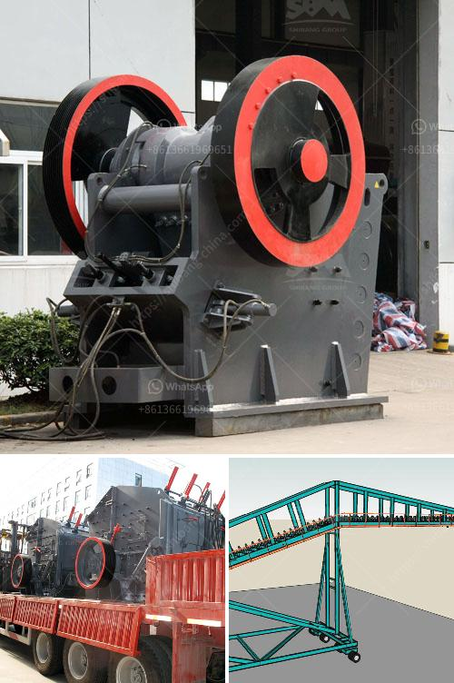

<h3>used stone crusher mini plant india</h3>
Quarrying and stone crushing industry is an important industrial sector in many countries engaged in producing crushed stone of various sizes depending upon the requirement which acts as raw material for various construction activities such as construction of roads, highways, bridges, buildings, and canals etc. It is estimated that there are over 12,000 stone crusher units in India. The number is expected to grow further keeping in view the future plans for development of infrastructure of roads, canals and buildings that are required for overall development of the country. In India, the stone crushing industry sector is estimated to have an annual turnover of around Rs. 5000 crore (equivalent to over US$ 1 billion) and is therefore an economically important sector.

Used stone crusher mini plant India has vast reserves of non-ferrous and non-metallic minerals, including dolomite, limestone, mica, barytes, graphite, quartzite, silica sand, barite, and quartz in varying quantities. The country’s mining industry has been driven by various factors including rising infrastructure development projects, rapid industrialization, increasing urbanization, and growth in the construction sector.

The stone crushing industry in India has been growing rapidly due to increasing demand from the construction industry for crushed stones. However, the question of the sustainability of such activities has gained prominence due to the potential environmental and health impacts associated with quarrying and stone crushing activities.

Quarrying involves significant environmental impacts including air pollution, noise pollution, loss of vegetation and wildlife habitats, water pollution from runoff and dust deposition, and land degradation. The stone crushers, therefore, need to be specifically designed to withstand these impacts and also to reduce their environmental footprint. It is noteworthy that using mini stone crushers preserves natural resources and reduces environmental impact.

Mini stone crusher machines are used on mining sites, construction sites, and recycling plants to crush different mineral materials into smaller particles or granules. These machines, as mentioned above, are designed for its reduction purpose. These mini stone crushers contribute to environmental protection because of the site's improvement in construction waste management.

India being a developing country, high urbanization rate and the increasing number of building construction projects are the drivers of the stone crushing equipment market. The increasing urbanization and construction industry also result in heavy construction equipment such as stone crushers, concrete mixers, and road rollers being utilized in various construction activities. The market for stone crushing equipment is expected to grow steadily over the forecast period.

In conclusion, the stone crushing industry in India is growing at a rapid pace and it is being fueled by the increasing infrastructure development projects in the country. This growth in the market is leading to increased demand for used stone crusher mini plant India. As a result, various manufacturers and suppliers are offering a wide range of stone crushers to cater to the growing needs of the industry. However, it is essential that these stone crushers are used responsibly and in accordance with the environmental regulations to minimize their negative impact on the environment and safeguard the natural resources.
<h3>Contact us</h3><ul><li><strong>Whatsapp:&nbsp;<a href="https://wa.me/8613661969651">+8613661969651</a></strong></li><li><a href="https://swt.shibang-china.com/?git&amp;zhl&amp;used stone crusher mini plant india"><strong>Online Service(chat now)</strong></a></li></ul><h3>Related</h3><ul><li><a href='tons a hour wash plant.md'>tons a hour wash plant</a></li><li><a href='stone crashers price in south africa.md'>stone crashers price in south africa</a></li><li><a href='pf trituradora de impacto.md'>pf trituradora de impacto</a></li><li><a href='chrome concentrate wash plant for sale.md'>chrome concentrate wash plant for sale</a></li><li><a href='about aggregate crushing comoany in ethiopia.md'>about aggregate crushing comoany in ethiopia</a></li></ul>